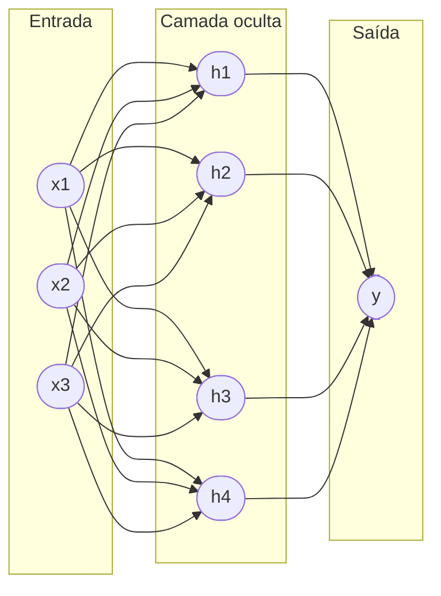
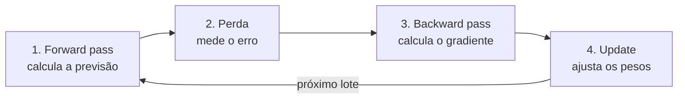
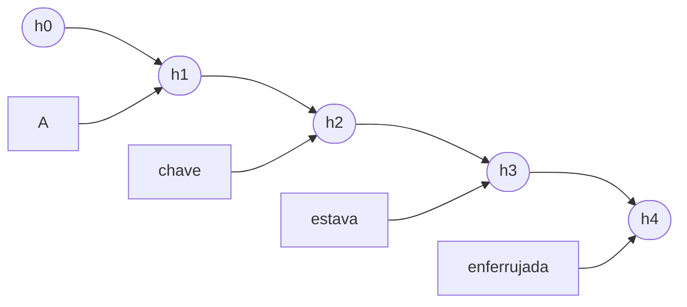
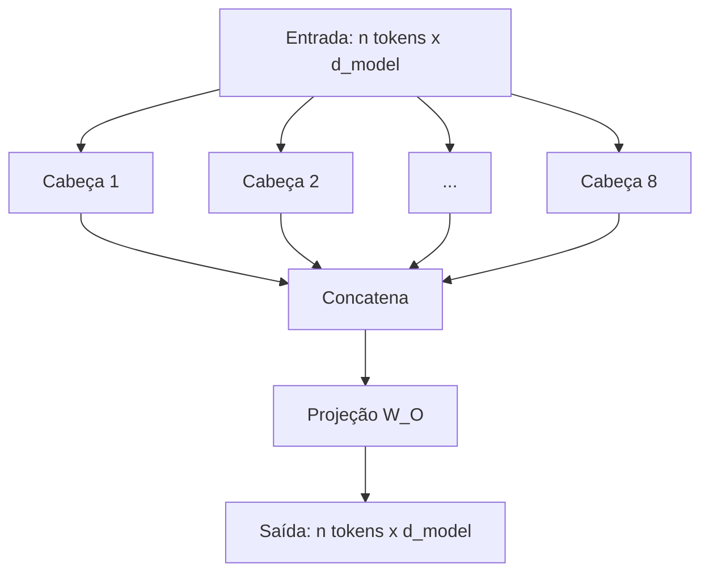
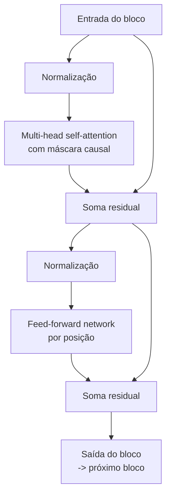
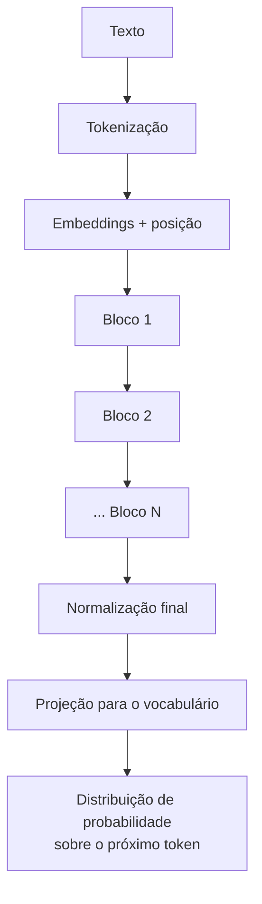
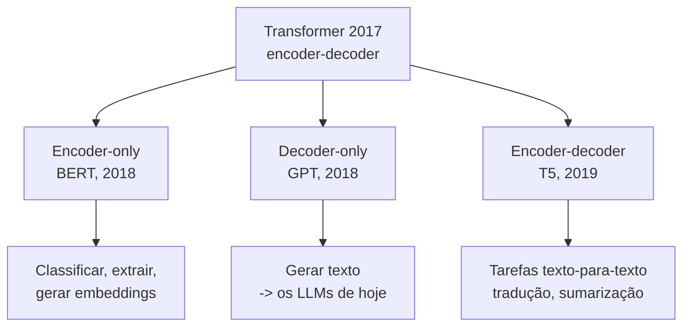
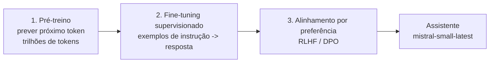

# IA Aplicada com LLMs — Aula 01: Fundamentos de LLMs e agentes — Redes neurais e a arquitetura Transformer

## Introdução

No primeiro exemplo de código do curso, [`00-prompt.py`](https://github.com/celsocrivelaro/senac-llm-code/blob/main/aula01-hello-world/00-prompt.py), você escreve umas dez linhas de Python, faz uma pergunta em português e recebe um texto coerente de volta. É fácil parar aí e tratar o modelo como um oráculo: entra pergunta, sai resposta.

Este curso não pára aí. Um LLM não é um oráculo nem um banco de dados de respostas — é uma **rede neural** com bilhões de números ajustados, executando uma conta bem definida. Toda decisão de engenharia que você vai tomar no resto da disciplina (por que a resposta muda entre execuções, por que o contexto tem limite, por que o custo cresce do jeito que cresce, por que o modelo inventa fatos com confiança, por que um agente precisa de ferramentas em vez de "saber" as coisas) é consequência direta dessa conta.

Então vamos abrir a caixa, de baixo para cima, em três degraus:

1. **O que é uma rede neural** — a peça elementar e como ela aprende.
2. **O que é o Transformer** — a arquitetura de 2017 e o problema concreto que ela veio resolver.
3. **Qual arquitetura gerou as LLMs** — por que, entre as variantes possíveis do Transformer, uma delas produziu o ChatGPT e as outras não.

Você não vai sair daqui treinando um LLM do zero (isso custa milhões de dólares em GPU). Vai sair sabendo **o que existe** dentro daquela chamada de API — o suficiente para depurar, escolher e projetar em cima dela.

> **Pré-requisito honesto:** álgebra linear básica (vetor, matriz, produto de matrizes) e a ideia de derivada. Se você não lembra de derivada, o texto explica a intuição sem exigir a conta.

---

## Objetivos de aprendizagem

Ao final desta nota você deve ser capaz de:

- Descrever a conta que um **neurônio artificial** faz e explicar por que a função de ativação não-linear é indispensável.
- Explicar como uma rede aprende: **função de perda**, **gradiente descendente** e **retropropagação**.
- Identificar os três problemas das **RNNs** com texto e explicar qual deles o Transformer eliminou.
- Explicar **self-attention** em termos de *query*, *key* e *value*, e calcular uma matriz de atenção pequena à mão.
- Justificar a necessidade do **positional encoding** e da **máscara causal**.
- Distinguir as arquiteturas **encoder-only**, **decoder-only** e **encoder-decoder**, e argumentar por que a decoder-only foi a que gerou as LLMs.
- Relacionar o custo **quadrático** da atenção ao limite de janela de contexto que você encontra na prática.

---

## Desenvolvimento teórico

### 1. O neurônio artificial: a peça elementar

#### 1.1 A conta que um neurônio faz

O nome "rede neural" carrega uma inspiração biológica que hoje é mais atrapalho do que ajuda. O neurônio artificial não simula uma célula: ele é uma função matemática de três linhas.

Ele recebe um vetor de entrada $x = [x_1, x_2, \ldots, x_n]$, tem um vetor de **pesos** $w = [w_1, w_2, \ldots, w_n]$ e um número chamado **viés** (*bias*) $b$. E faz:

$$z = w \cdot x + b = \sum_{i=1}^{n} w_i x_i + b$$

$$a = \sigma(z)$$

Ou seja: **uma soma ponderada, seguida de uma função** $\sigma$. É isso. Os pesos dizem quanto cada entrada importa; o viés desloca o resultado; a função $\sigma$ (a **ativação**) esmaga ou recorta o valor.

Um exemplo numérico. Imagine um neurônio que decide se um e-mail é spam a partir de três medidas: quantidade de links ($x_1$), quantidade de palavras em CAIXA ALTA ($x_2$) e se o remetente é conhecido ($x_3$, sendo 1 = conhecido).

Com $w = [0{,}8,\ 0{,}6,\ -2{,}0]$ e $b = -1{,}5$, um e-mail com 3 links, 2 palavras em caixa alta e remetente desconhecido ($x = [3, 2, 0]$) dá:

$$z = 0{,}8 \times 3 + 0{,}6 \times 2 + (-2{,}0) \times 0 - 1{,}5 = 2{,}4 + 1{,}2 + 0 - 1{,}5 = 2{,}1$$

$$a = \sigma(2{,}1) = \frac{1}{1 + e^{-2{,}1}} \approx 0{,}89$$

Leia o resultado: **89%**. Note o peso $-2{,}0$ em $x_3$ — remetente conhecido derruba a pontuação com força. Ninguém escreveu esses números à mão; eles saíram do treino (seção 3).

#### 1.2 Por que a não-linearidade é indispensável

Aqui está o ponto que mais gente pula e que é o coração da coisa: **sem a função de ativação, empilhar camadas é inútil.**

Suponha duas camadas sem ativação. A primeira faz $h = W_1 x + b_1$, a segunda faz $y = W_2 h + b_2$. Substituindo:

$$y = W_2 (W_1 x + b_1) + b_2 = (W_2 W_1) x + (W_2 b_1 + b_2)$$

Mas $W_2 W_1$ é só outra matriz, e $W_2 b_1 + b_2$ é só outro vetor. Chame-os de $W'$ e $b'$: você tem $y = W' x + b'$ — **uma única camada linear**. Duas camadas, cem camadas, mil camadas: sem ativação, tudo colapsa em uma. A rede profunda não é mais expressiva que uma reta.

O caso clássico que expõe isso é o **XOR**. Considere quatro pontos no plano com os rótulos do ou-exclusivo:

| $x_1$ | $x_2$ | XOR |
|---|---|---|
| 0 | 0 | 0 |
| 0 | 1 | 1 |
| 1 | 0 | 1 |
| 1 | 1 | 0 |

Tente desenhar **uma reta** que separe os `1` dos `0`. Não existe: os dois `1` estão em cantos opostos, e os dois `0` também. O XOR não é **linearmente separável**, e por isso um modelo linear (um único neurônio, ou qualquer pilha de camadas sem ativação) **nunca** resolve esse problema — ele erra sempre em pelo menos um dos quatro pontos. Foi essa limitação, apontada por Minsky e Papert em 1969, que congelou a área por uma década.

A ativação não-linear quebra o colapso: com ela, cada camada pode *dobrar* o espaço, e a composição de dobras cria fronteiras arbitrariamente complexas. Na seção 3.4 você vai ver uma rede de duas camadas resolvendo o XOR de fato.

#### 1.3 As funções de ativação que importam

| Função | Fórmula | Onde aparece |
|---|---|---|
| **Sigmoid** | $\sigma(z) = \dfrac{1}{1+e^{-z}}$ | Saída de classificadores binários. Satura nos extremos, o que atrapalha o treino de redes profundas. |
| **Tanh** | $\tanh(z)$ | RNNs clássicas. Centrada em zero, mas também satura. |
| **ReLU** | $\max(0, z)$ | O padrão do deep learning moderno. Barata e não satura para $z>0$. Usada na FFN do Transformer original. |
| **GELU** | $z \cdot \Phi(z)$ | GPT-2 em diante. Uma ReLU "suavizada". |
| **SwiGLU** | variante com porta multiplicativa | Llama, Mistral e a maioria dos LLMs atuais. |

Você não precisa memorizar as fórmulas. Precisa reter duas coisas: **a ativação existe para introduzir não-linearidade**, e a escolha específica é uma otimização empírica — a família de modelos que você vai chamar via API usa SwiGLU porque, na prática, treina um pouco melhor.

---

### 2. Da peça à rede: camadas

#### 2.1 O passo para frente é multiplicação de matrizes

Um neurônio devolve um número. Coloque vários lado a lado, todos recebendo a mesma entrada, e você tem uma **camada**. Empilhe camadas, ligando a saída de uma na entrada da seguinte, e você tem uma **rede neural profunda** — no jargão, um MLP (*multi-layer perceptron*) ou rede *densa*.



Em vez de escrever a conta neurônio por neurônio, junte os pesos numa **matriz**. Se a camada tem $n$ entradas e $m$ neurônios, os pesos formam uma matriz $W$ de tamanho $n \times m$, e a camada inteira é:

$$a = \sigma(x W + b)$$

Isso é o **forward pass** (passo para frente): um produto de matrizes por camada, mais uma ativação. E é exatamente por isso que **GPU** virou o hardware da IA: placa de vídeo foi projetada para multiplicar matrizes grandes em paralelo, que é 99% do que uma rede neural faz. Guarde essa ideia — ela reaparece na seção 5, quando o Transformer for justamente a arquitetura que consegue usar esse paralelismo até o fim.

#### 2.2 Contando parâmetros

Os **parâmetros** de uma rede são todos os pesos e vieses — os números aprendidos. Numa camada de $n$ entradas e $m$ neurônios: $n \times m$ pesos $+\ m$ vieses.

Uma rede de $784 \to 128 \to 10$ (o exemplo canônico de reconhecer dígitos manuscritos) tem:

- camada 1: $784 \times 128 + 128 = 100.480$
- camada 2: $128 \times 10 + 10 = 1.290$
- **total: 101.770 parâmetros**

Cem mil. Quando alguém diz que um modelo tem "7 bilhões de parâmetros", é essa mesma contagem — só que setenta mil vezes maior. Na seção 6.3 fazemos essa conta para um LLM real.

#### 2.3 Por que isso funciona: aproximação universal

Existe um resultado teórico (Cybenko, 1989; Hornik, 1991) chamado **teorema da aproximação universal**: uma rede com uma única camada oculta, com neurônios suficientes e ativação não-linear, aproxima *qualquer* função contínua com a precisão que você quiser.

É um resultado libertador e enganoso ao mesmo tempo. Libertador porque garante que a arquitetura não é o gargalo: rede neural é uma família de funções expressiva o suficiente para o que você quiser modelar. Enganoso porque o teorema **não diz** quantos neurônios são necessários (pode ser um número absurdo), nem que o treino vai *encontrar* essa função. Na prática, **profundidade** (muitas camadas) se mostrou bem mais eficiente que **largura** (uma camada gigante) — e é por isso que o campo se chama *deep* learning.

---

### 3. Como uma rede aprende

Até aqui a rede é uma função com números arbitrários dentro. Treinar é **ajustar esses números** para que a saída se aproxime do que queremos.

O ciclo tem quatro passos, repetidos milhões de vezes:



#### 3.1 A função de perda

A **perda** (*loss*) é um número único que mede o quanto a rede errou. Quanto menor, melhor. As duas mais comuns:

- **Erro quadrático médio** (regressão, quando a saída é um número): $L = \frac{1}{N}\sum (y_{\text{previsto}} - y_{\text{real}})^2$
- **Entropia cruzada** (classificação, quando a saída é uma distribuição de probabilidade): $L = -\sum y_{\text{real}} \log(y_{\text{previsto}})$

A entropia cruzada merece atenção porque **é a perda usada para treinar LLMs**. Ela pune com força a confiança errada: se o modelo atribuiu probabilidade 0,01 à palavra que de fato apareceu, $-\log(0{,}01) \approx 4{,}6$ — uma perda alta. Se atribuiu 0,9, $-\log(0{,}9) \approx 0{,}1$. Treinar um LLM é minimizar essa perda sobre trilhões de tokens de texto: **"quão surpreso o modelo ficou com a palavra que realmente veio?"**

#### 3.2 Gradiente descendente

Como ajustar milhões de pesos na direção certa? Imagine a perda como uma paisagem montanhosa onde cada eixo é um peso e a altitude é o erro. Você quer chegar ao fundo de um vale, mas está no escuro e só consegue sentir a **inclinação do chão sob os pés**.

A estratégia óbvia: dê um passo na direção mais íngreme para baixo, repita. Essa inclinação, em várias dimensões, é o **gradiente** — o vetor de derivadas parciais $\partial L / \partial w_i$, que diz o quanto a perda muda quando você mexe um tiquinho em cada peso. A regra de atualização é:

$$w \leftarrow w - \eta \cdot \frac{\partial L}{\partial w}$$

O $\eta$ (eta) é a **taxa de aprendizado** (*learning rate*), o tamanho do passo. É o hiperparâmetro mais sensível do treino: grande demais e você salta por cima do vale, oscilando sem convergir; pequeno demais e o treino demora eternidades.

Na prática não se calcula o gradiente sobre o conjunto inteiro a cada passo (caro) nem sobre um exemplo só (ruidoso), mas sobre um **lote** (*batch*) de algumas centenas de exemplos — daí o nome **gradiente descendente estocástico** (SGD). Uma passada completa pelos dados é uma **época**.

#### 3.3 Retropropagação

Falta o "como" do gradiente. Numa rede de muitas camadas, o peso da primeira camada influencia a perda por um caminho longo: ele afeta $h_1$, que afeta $h_2$, que afeta a saída, que afeta a perda. A **retropropagação** (*backpropagation*, Rumelhart, Hinton e Williams, 1986) é a aplicação organizada da **regra da cadeia** do cálculo para percorrer esse caminho de trás para frente:

$$\frac{\partial L}{\partial w_1} = \frac{\partial L}{\partial a_{\text{saída}}} \cdot \frac{\partial a_{\text{saída}}}{\partial h_2} \cdot \frac{\partial h_2}{\partial h_1} \cdot \frac{\partial h_1}{\partial w_1}$$

A intuição: o erro nasce na saída e é **distribuído para trás**, camada por camada, e cada peso recebe a parcela de culpa proporcional à sua contribuição. O truque de engenharia é que os resultados intermediários são reaproveitados, o que faz o custo do backward pass ser da mesma ordem do forward — sem isso, redes profundas seriam inviáveis.

Você nunca vai escrever isso à mão: PyTorch e TensorFlow derivam automaticamente. Mas é importante saber que existe, porque dois problemas famosos vêm daqui. Como o gradiente é um **produto** de muitos fatores, se eles são menores que 1 o produto encolhe até virar zero (**vanishing gradient** — camadas iniciais param de aprender) e se são maiores que 1 ele explode. Metade dos truques do deep learning moderno (ReLU, conexões residuais, normalização de camada) existe para controlar isso.

#### 3.4 Exemplo completo: XOR em numpy puro

Vamos fechar a seção resolvendo o XOR — o problema que, na seção 1.2, provamos impossível para um modelo linear. Duas camadas, ativação sigmoid, retropropagação escrita à mão, sem framework:

```python
import numpy as np

rng = np.random.default_rng(42)

X = np.array([[0, 0], [0, 1], [1, 0], [1, 1]], dtype=float)
y = np.array([[0], [1], [1], [0]], dtype=float)

def sigmoid(z):
    return 1 / (1 + np.exp(-z))

# 2 entradas -> 4 neurônios ocultos -> 1 saída
W1 = rng.normal(0, 1, (2, 4)); b1 = np.zeros((1, 4))
W2 = rng.normal(0, 1, (4, 1)); b2 = np.zeros((1, 1))
taxa = 0.5

for epoca in range(10001):
    # 1. forward pass
    a1 = sigmoid(X @ W1 + b1)
    a2 = sigmoid(a1 @ W2 + b2)

    # 2. perda (entropia cruzada binária)
    perda = -np.mean(y * np.log(a2 + 1e-9) + (1 - y) * np.log(1 - a2 + 1e-9))

    # 3. backward pass (regra da cadeia, camada por camada)
    d2 = (a2 - y) / len(X)
    dW2 = a1.T @ d2; db2 = d2.sum(0, keepdims=True)
    d1 = (d2 @ W2.T) * a1 * (1 - a1)      # derivada da sigmoid = a(1-a)
    dW1 = X.T @ d1; db1 = d1.sum(0, keepdims=True)

    # 4. update
    W2 -= taxa * dW2; b2 -= taxa * db2
    W1 -= taxa * dW1; b1 -= taxa * db1

    if epoca % 2000 == 0:
        print(f"época {epoca:5d}  perda {perda:.4f}")

print("previsões:", np.round(a2, 3).ravel())
```

Saída:

```
época     0  perda 0.7568
época  2000  perda 0.0128
época  4000  perda 0.0039
época  6000  perda 0.0022
época  8000  perda 0.0015
época 10000  perda 0.0011
previsões: [0.001 0.999 0.999 0.002]
```

Compare com os rótulos `[0, 1, 1, 0]`: a rede acertou os quatro casos. **Quatro neurônios ocultos e uma não-linearidade** bastaram para resolver o que nenhum modelo linear resolve.

E note a estrutura do loop: forward, perda, backward, update. Treinar um LLM de 7 bilhões de parâmetros é **este mesmo loop**. O que muda é a escala (trilhões de tokens, milhares de GPUs, semanas de treino) e a arquitetura da função que faz o forward pass — que é o assunto das próximas seções.

---

### 4. Por que texto quebra a rede comum

Temos uma máquina de aprender funções. Por que ela não resolve linguagem direto?

#### 4.1 O problema do tamanho variável

Um MLP tem entrada de **tamanho fixo**: 784 pixels, 3 features de e-mail. Texto não é assim. "Oi" tem duas letras; um contrato tem 40 mil palavras. E não é só o tamanho: a **ordem importa** e as **dependências são de longa distância**. Em

> "A **chave** que o técnico deixou sobre a mesa da recepção do prédio antigo, depois de três horas de manutenção, **estava** enferrujada."

para conjugar "estava" o modelo precisa ligá-la a "chave", 17 palavras antes. Um MLP com janela fixa de 5 palavras não tem como.

#### 4.2 RNNs: memória por estado oculto

A resposta dos anos 90–2010 foram as **redes recorrentes** (RNN). A ideia: processe um token por vez, carregando um **estado oculto** $h$ que resume tudo que veio antes.

$$h_t = \sigma(W_h h_{t-1} + W_x x_t + b)$$



Elegante: aceita qualquer tamanho e, em teoria, carrega informação indefinidamente. As **LSTM** (Hochreiter e Schmidhuber, 1997) melhoraram isso com portas que decidem o que guardar e o que esquecer, e dominaram tradução automática por anos.

#### 4.3 Os três problemas

Mas as RNNs travaram em três pontos:

1. **Memória que desbota.** Toda a informação passa por um vetor $h$ de tamanho fixo. Comprimir 500 palavras num vetor de 512 números perde coisa — e o que se perde primeiro é o começo da sequência.
2. **Gradiente que desaparece.** Retropropagar por 500 passos de tempo é multiplicar 500 fatores (seção 3.3). O produto tende a zero e a rede não consegue aprender dependências longas.
3. **Sequencialidade — o problema fatal.** Para calcular $h_{100}$ você precisa de $h_{99}$, que precisa de $h_{98}$… Um texto de mil tokens exige **mil passos em série**. Não há como paralelizar, e a GPU — hardware feito para fazer milhares de contas ao mesmo tempo — fica ociosa.

O ponto 3 é o que importa historicamente. Os pontos 1 e 2 são sobre qualidade; o ponto 3 é sobre **escala**. Enquanto o treino é sequencial, você não pode simplesmente jogar mais GPU e mais dados no problema.

#### 4.4 A atenção nasce como remendo

Em 2014, Bahdanau e colegas atacaram o problema 1 com uma ideia nova: em vez de forçar o decodificador a depender de um único vetor final, deixe-o **olhar de volta para todos os estados** da entrada e *pesar* quais são relevantes a cada momento. Chamaram isso de **atenção**.

Funcionou muito bem — mas ainda era um acessório colado numa RNN, que continuava sequencial. Até que alguém fez a pergunta óbvia:

> **E se a atenção não for o acessório, e sim a arquitetura inteira? E se jogarmos a recorrência fora?**

---

### 5. O Transformer

#### 5.1 O que ele veio resolver

Em junho de 2017, oito pesquisadores do Google publicaram **"Attention Is All You Need"** (Vaswani et al., NeurIPS 2017). O título é literalmente a tese: remova a recorrência e a convolução, fique só com a atenção.

O contexto do problema era prático. O Google traduzia bilhões de frases por dia e treinar modelos de tradução baseados em LSTM levava **semanas**, porque o treino não paralelizava. O objetivo declarado no paper não era "criar a IA geral" — era **treinar mais rápido e com melhor qualidade em tradução**. O modelo original tinha 65 milhões de parâmetros e foi treinado em 12 horas em 8 GPUs, batendo o estado da arte em tradução inglês–alemão.

O ganho central: **sem recorrência, todos os tokens podem ser processados ao mesmo tempo durante o treino.** A sequência de mil passos em série vira uma multiplicação de matrizes que a GPU resolve de uma vez. Foi essa mudança que destravou a escala — e a escala, como veremos na seção 6, é o que produziu os LLMs.

> Vale registrar o acidente histórico: o Transformer foi inventado para **tradução**. Ninguém em 2017 escreveu que aquilo geraria assistentes conversacionais. A generalidade foi descoberta depois.

#### 5.2 Self-attention: query, key, value

A operação central é a **auto-atenção** (*self-attention*): cada token olha para todos os outros tokens da mesma sequência e monta uma nova representação de si mesmo, misturando informação de quem é relevante para ele.

A analogia mais útil é a de uma **busca**. Para cada token, a rede projeta três vetores diferentes, cada um com sua matriz de pesos aprendida:

| Vetor | Matriz | Papel |
|---|---|---|
| **Query** ($q$) | $W_Q$ | "o que eu estou procurando" |
| **Key** ($k$) | $W_K$ | "o que eu tenho a oferecer" |
| **Value** ($v$) | $W_V$ | "a informação que eu entrego se for escolhido" |

O processo, para um token:

1. Compare minha *query* com a *key* de cada token → um score de compatibilidade por token.
2. Passe os scores por um softmax → pesos que somam 1.
3. Some os *values* de todos os tokens, ponderados por esses pesos.

Concretamente, na frase *"O gato não subiu na árvore porque **ele** estava com medo"*, quando o modelo processa "ele", a *query* de "ele" bate forte com a *key* de "gato" e fraco com a de "árvore" — e a nova representação de "ele" incorpora o *value* de "gato". Foi assim que a correferência foi resolvida: não por regra gramatical programada, mas por pesos aprendidos.

#### 5.3 A fórmula

Empilhando todos os tokens em matrizes $Q$, $K$ e $V$ (uma linha por token), a operação inteira é uma linha:

$$\text{Attention}(Q, K, V) = \text{softmax}\!\left(\frac{Q K^{\top}}{\sqrt{d_k}}\right) V$$

Desmontando:

- $Q K^{\top}$ — produto de cada query com cada key. Se há $n$ tokens, o resultado é uma matriz $n \times n$: **quanto cada token deve olhar para cada outro**.
- $\sqrt{d_k}$ — normalização. Com $d_k$ grande, os produtos escalares crescem em magnitude; jogados num softmax, produzem uma distribuição quase one-hot (toda a massa num único token), e o gradiente ali é quase zero — o treino trava. Dividir pela raiz da dimensão mantém os scores numa faixa saudável. Daí o nome *scaled* dot-product attention.
- $\text{softmax}$ — transforma cada linha em distribuição de probabilidade (positivos, somando 1).
- $\cdot V$ — a média ponderada dos values.

Repare no que **não** está aí: nenhum loop, nenhuma dependência de passo anterior. São dois produtos de matrizes e um softmax — tudo paralelizável.

#### 5.4 Múltiplas cabeças

Uma única atenção precisaria escolher *um* tipo de relação para capturar. Mas linguagem tem várias simultâneas: concordância verbal, correferência, escopo de negação, relação entre adjetivo e substantivo.

A solução é a **multi-head attention**: rode a atenção $h$ vezes em paralelo (o original usava $h = 8$), cada "cabeça" com suas próprias matrizes $W_Q, W_K, W_V$ e trabalhando numa fatia menor da dimensão. Depois concatene as saídas e passe por uma projeção final $W_O$.



Quando se inspecionam as cabeças de um modelo treinado, algumas de fato se especializam de forma interpretável — uma acompanha o token anterior, outra liga verbo e sujeito, outra rastreia delimitadores. Não é uma divisão limpa nem projetada; é um efeito colateral do treino.

#### 5.5 O Transformer não sabe a ordem: positional encoding

Aqui há uma consequência incômoda da fórmula. Olhe de novo: $\text{softmax}(QK^\top/\sqrt{d_k})V$. Se você **permutar** a ordem dos tokens de entrada, as linhas de $Q$, $K$ e $V$ permutam junto e a saída sai exatamente igual — apenas permutada. A atenção **não tem noção de ordem**: para ela, a entrada é um *conjunto* de tokens, não uma sequência.

Ou seja, sem correção, "o homem morde o cão" e "o cão morde o homem" seriam processados de maneira indistinguível. Inaceitável.

A solução é injetar a posição na própria representação: o **positional encoding**. O paper original somava a cada embedding um vetor fixo construído com senos e cossenos de frequências diferentes:

$$PE_{(pos, 2i)} = \sin\!\left(\frac{pos}{10000^{2i/d}}\right), \qquad PE_{(pos, 2i+1)} = \cos\!\left(\frac{pos}{10000^{2i/d}}\right)$$

A escolha por senoides tinha um motivo: posições relativas ficam expressáveis como transformações lineares, o que ajuda o modelo a generalizar para comprimentos não vistos. Os LLMs atuais (Llama, Mistral) usam uma variante melhor, o **RoPE** (*Rotary Position Embedding*), que codifica a posição **rotacionando** os vetores de query e key — o que faz o score depender naturalmente da *distância relativa* entre os tokens.

Você vai encontrar essa engrenagem na prática. Quando um provedor anuncia "agora com 128 mil tokens de contexto", boa parte do trabalho está em como o positional encoding foi estendido para posições muito além do que o modelo viu no treino.

#### 5.6 O resto do bloco: FFN, residual e normalização

A atenção **mistura informação entre tokens**. Falta processar cada token individualmente, e é o papel da **feed-forward network** (FFN): um MLP de duas camadas (exatamente o da seção 2) aplicado **de forma independente em cada posição**, com a camada intermediária tipicamente 4× maior que $d_{model}$.

Curiosidade sobre onde ficam os números: a FFN concentra **cerca de dois terços dos parâmetros** de um Transformer. É lugar-comum dizer que "a atenção é o cérebro do modelo", mas em volume de parâmetros a maior parte do conhecimento factual mora na FFN.

Dois mecanismos amarram tudo:

- **Conexão residual** — a saída de cada sub-camada é somada à sua entrada: $x + \text{Atenção}(x)$. Isso dá ao gradiente um caminho curto de volta, permitindo empilhar dezenas de camadas sem que o gradiente desapareça (o problema da seção 3.3).
- **Normalização de camada** (LayerNorm, ou RMSNorm nos modelos atuais) — reescala as ativações para média e variância controladas, estabilizando o treino.

#### 5.7 A máscara causal

Falta uma peça essencial para gerar texto. Um LLM é treinado para **prever o próximo token**. Se, ao prever a palavra da posição 5, o modelo puder olhar a posição 6, a tarefa é trivial — ele lê a resposta. Isso é vazamento de informação, e o modelo aprenderia nada útil.

A correção é a **máscara causal**: antes do softmax, todos os scores que apontam para o futuro recebem $-\infty$, o que faz o softmax atribuir-lhes peso zero. Cada token só olha para si mesmo e para os anteriores. A matriz de atenção fica **triangular inferior**:

```
          O    gato  subiu  nele
O       [1.00  0.00  0.00  0.00]
gato    [0.40  0.60  0.00  0.00]
subiu   [0.03  0.33  0.64  0.00]
nele    [0.09  0.32  0.58  0.01]
```

(Estes são os números reais do exemplo executável da seção "Exemplos". Como os pesos ali são aleatórios, os valores ilustram a **mecânica** — a forma triangular e as linhas somando 1 — não o comportamento linguístico de um modelo treinado.)

Essa máscara é o que separa um **decoder** de um **encoder**, e é a distinção que organiza a seção 6.

#### 5.8 O bloco completo

Juntando as peças, um bloco decoder-only — o tijolo repetido dezenas de vezes num LLM:



E o modelo inteiro:



Note o formato da saída: **não é uma palavra, é uma distribuição de probabilidade sobre todo o vocabulário**. Escolher um token dessa distribuição é uma decisão separada, controlada por parâmetros como `temperature` — e é a razão pela qual a mesma pergunta pode gerar respostas diferentes. Isso é assunto da Parte 2 desta aula.

#### 5.9 O preço: custo quadrático

Se cada token olha para todos os outros, a matriz de atenção tem $n^2$ entradas. **Dobrar o tamanho do contexto quadruplica o custo da atenção** (em tempo e em memória).

| Tokens no contexto | Entradas na matriz de atenção |
|---|---|
| 1.000 | 1 milhão |
| 10.000 | 100 milhões |
| 100.000 | 10 bilhões |

Aqui está a origem, em uma linha, de várias coisas que você vai encontrar como engenheiro: por que janela de contexto tem limite, por que contexto longo é caro e lento, por que existe uma disciplina inteira de *context engineering* para decidir o que colocar no prompt, e por que RAG (buscar só os pedaços relevantes) venceu "jogue o documento todo no contexto". O Mistral, aliás, mitiga isso com **sliding window attention** (cada token olha só uma janela dos anteriores) e **grouped-query attention** (várias queries compartilham as mesmas keys e values, cortando memória).

Este é o **trade-off fundamental do Transformer**: ele trocou a sequencialidade da RNN (que era barata em memória mas impossível de paralelizar) por um custo quadrático (paralelizável, mas caro em contexto longo). Foi um ótimo negócio para o hardware disponível — e continua sendo o limite prático que você negocia todo dia.

---

### 6. A arquitetura que gerou as LLMs

O Transformer de 2017 era um **encoder-decoder** para tradução: o encoder lia a frase em inglês, o decoder escrevia em alemão. A partir dele, a comunidade separou três linhagens — e só uma virou LLM.

#### 6.1 Três famílias



| | **Encoder-only** | **Decoder-only** | **Encoder-decoder** |
|---|---|---|---|
| Exemplo | BERT | GPT, Llama, Mistral, Claude | T5, BART |
| Atenção | bidirecional (vê todo o texto) | causal (só o passado) | bidirecional na entrada, causal na saída |
| Treinado para | preencher lacunas (*masked LM*) | prever o próximo token | mapear texto de entrada em texto de saída |
| Sabe gerar texto livre? | não | **sim** | sim |
| Uso hoje | embeddings, classificação, busca semântica | **assistentes, agentes, copilotos** | tarefas de conversão específicas |

O BERT não é um modelo inferior — ele *vê o texto inteiro de uma vez*, o que o torna melhor em entender do que em escrever. Você vai reencontrá-lo no curso: os modelos de **embedding** usados em busca semântica e RAG são tipicamente encoder-only.

#### 6.2 Por que decoder-only venceu

A vitória da linhagem decoder-only não foi por elegância arquitetural. Foi por uma propriedade do **objetivo de treino**.

1. **O rótulo já está no dado.** "Prever o próximo token" não precisa de anotação humana: qualquer texto do mundo é, simultaneamente, entrada e resposta. Isso liberou o treino sobre a internet inteira — trilhões de tokens sem custo de rotulagem. Nenhuma outra tarefa de NLP tinha dados nessa escala.
2. **Uma tarefa que contém todas as outras.** Para prever bem a próxima palavra em qualquer texto, o modelo é forçado a aprender gramática, fatos, tradução, estilo, aritmética e cadeias de raciocínio. Resumir, classificar e traduzir viram **casos particulares** de continuar texto.
3. **Uma interface única.** Como tudo é texto entrando e texto saindo, não é preciso uma cabeça de saída diferente por tarefa. Foi o que permitiu o **in-context learning**: você descreve a tarefa no prompt, sem retreinar nada. Essa propriedade — descoberta, não projetada — é a base de todo este curso.

#### 6.3 Escala: quando quantidade virou qualidade

Com o objetivo certo e dados ilimitados, restava crescer. E aí veio a descoberta mais consequente da área: **as leis de escala** (Kaplan et al., 2020). A perda de um LLM cai de forma **previsível**, seguindo uma lei de potência, à medida que você aumenta parâmetros, dados e computação. Previsível o suficiente para justificar investimento: dá para estimar o desempenho de um modelo *antes* de treiná-lo.

Um refinamento importante veio com o **Chinchilla** (Hoffmann et al., 2022), que mostrou que os modelos da época eram grandes demais para a quantidade de dados usada. A regra prática que saiu daí: **cerca de 20 tokens de treino por parâmetro**. É por isso que modelos de 7B treinados em trilhões de tokens (Llama, Mistral) competem com modelos muito maiores da geração anterior — e por isso "modelo pequeno e bem treinado" virou uma categoria comercial viável.

Vamos fazer a conta de parâmetros para um LLM real. Num bloco decoder-only, ignorando vieses: a atenção usa 4 matrizes $d \times d$ ($W_Q, W_K, W_V, W_O$), somando $4d^2$; a FFN usa duas matrizes $d \times 4d$, somando $8d^2$. Total por bloco: $12d^2$. Para $N$ blocos:

$$\text{parâmetros} \approx 12 \cdot N \cdot d_{model}^2$$

Aplicando ao GPT-3, que tem $N = 96$ e $d_{model} = 12288$:

$$12 \times 96 \times 12288^2 \approx 1{,}74 \times 10^{11} = \textbf{174 bilhões}$$

Que é, de fato, o "175B" do nome. A mesma conta da seção 2.2 — pesos e vieses — só que com $d_{model}$ de doze mil em vez de cento e vinte e oito.

#### 6.4 De "prever token" a assistente

Um modelo apenas pré-treinado não é um assistente: pergunte algo a ele e é tão provável que ele continue com mais perguntas parecidas quanto que responda — afinal, ele imita texto da internet. Falta um alinhamento, feito em duas etapas depois do pré-treino:



A etapa 1 custa milhões de dólares e cria o **conhecimento**; as etapas 2 e 3 são comparativamente baratas e criam o **comportamento** (seguir instruções, formato de resposta, recusas). O marco público foi o InstructGPT (Ouyang et al., 2022), que virou o ChatGPT em novembro de 2022. Nada de novo em arquitetura — o mesmo decoder-only, agora alinhado. Este pipeline volta na aula de fine-tuning.

#### 6.5 Linha do tempo

| Ano | Marco | Por que importa |
|---|---|---|
| 1958 | Perceptron (Rosenblatt) | o neurônio artificial |
| 1986 | Retropropagação (Rumelhart, Hinton, Williams) | treinar redes profundas fica viável |
| 1997 | LSTM (Hochreiter, Schmidhuber) | memória mais longa em sequências |
| 2014 | Seq2seq + atenção (Sutskever; Bahdanau) | a atenção aparece, como acessório |
| **2017** | **Transformer** (Vaswani et al.) | **fim da recorrência; treino paraleliza** |
| 2018 | BERT e GPT-1 | a bifurcação encoder-only / decoder-only |
| 2020 | GPT-3 (175B) + leis de escala | escala funciona; surge o in-context learning |
| 2022 | InstructGPT → ChatGPT | alinhamento transforma modelo em produto |
| 2023– | Llama, Mistral, Claude, GPT-4 | modelos abertos e eficientes; contexto longo; uso de ferramentas |

Repare que a arquitetura central **não mudou desde 2017**. O que mudou foi escala, dados, alinhamento e otimizações de eficiência.

#### 6.6 O que roda quando você chama a API

Voltemos ao [`00-prompt.py`](https://github.com/celsocrivelaro/senac-llm-code/blob/main/aula01-hello-world/00-prompt.py):

```python
response = client.chat.completions.create(
    model="mistral-small-latest",
    messages=[{"role": "user", "content": "Por que o céu é azul?"}],
)
```

Agora você pode traduzir cada etapa do que acontece do outro lado:

1. As mensagens são formatadas num único texto e **tokenizadas** (Parte 2 desta aula).
2. Cada token vira um vetor (**embedding**) com informação de posição somada.
3. Os vetores atravessam dezenas de **blocos decoder-only**: multi-head self-attention causal + FFN, com residual e normalização.
4. A última camada projeta no vocabulário: uma **distribuição de probabilidade** sobre o próximo token.
5. Um token é **sorteado** dessa distribuição.
6. O token sorteado é anexado à entrada e o processo **recomeça do passo 3** — é isso que produz o texto saindo palavra por palavra, e a razão de a geração ser inerentemente sequencial (mesmo que o *treino* seja paralelo).
7. Pára quando sai um token especial de fim ou quando o limite de tokens é atingido.

Duas consequências que você usa todo dia caem direto disso. **A resposta varia entre execuções** porque o passo 5 é um sorteio. E **o modelo não "consulta" nada**: ele não tem acesso a banco, arquivo ou internet — só aos pesos congelados no treino e ao texto do contexto. É exatamente essa limitação que motiva RAG e, na Parte 3, os **agentes com ferramentas**.

---

## Exemplos

### Exemplo 1 — Self-attention causal em numpy

Vinte linhas que implementam a fórmula da seção 5.3 com máscara causal, para você ver a matriz de atenção existindo:

```python
import numpy as np
np.set_printoptions(precision=3, suppress=True)

tokens = ["O", "gato", "subiu", "nele"]
d_model = d_k = 6
rng = np.random.default_rng(0)

# Embeddings e matrizes de projeção — aqui aleatórios; num modelo real, aprendidos
E  = rng.normal(0, 1, (len(tokens), d_model))
Wq = rng.normal(0, 1, (d_model, d_k))
Wk = rng.normal(0, 1, (d_model, d_k))
Wv = rng.normal(0, 1, (d_model, d_k))

Q, K, V = E @ Wq, E @ Wk, E @ Wv

# 1. scores = QK^T / sqrt(d_k)
scores = Q @ K.T / np.sqrt(d_k)

# 2. máscara causal: o futuro recebe -infinito
causal = np.triu(np.ones_like(scores), k=1).astype(bool)
scores = np.where(causal, -np.inf, scores)

# 3. softmax por linha
def softmax(x):
    x = x - x.max(axis=-1, keepdims=True)
    e = np.exp(x)
    return e / e.sum(axis=-1, keepdims=True)

A = softmax(scores)

# 4. média ponderada dos values
saida = A @ V

print("matriz de atenção (linha = quem olha, coluna = quem é olhado):")
for tok, linha in zip(tokens, A):
    print(f"  {tok:8s}", linha)
print("soma de cada linha:", A.sum(axis=1))
print("shape da saída:", saida.shape)
```

Saída:

```
matriz de atenção (linha = quem olha, coluna = quem é olhado):
  O        [1. 0. 0. 0.]
  gato     [0.4 0.6 0.  0. ]
  subiu    [0.028 0.334 0.638 0.   ]
  nele     [0.088 0.319 0.578 0.014]
soma de cada linha: [1. 1. 1. 1.]
shape da saída: (4, 6)
```

Três coisas para observar:

- A matriz é **triangular inferior** — o zero acima da diagonal é a máscara causal em ação. O primeiro token só pode olhar para si mesmo, e por isso seu peso é 1,0.
- Cada linha **soma exatamente 1** — é o softmax.
- A saída tem o **mesmo shape da entrada** (4 tokens × 6 dimensões). Por isso os blocos podem ser empilhados indefinidamente.

O que este exemplo *não* mostra: comportamento linguístico. Com pesos aleatórios, o fato de "nele" dar peso 0,58 a "subiu" é coincidência numérica. Num modelo treinado, esses pesos codificam relações reais — e é só o treino que faz a diferença.

### Exemplo 2 — Estimando o tamanho de um modelo

Aplicando $12 \cdot N \cdot d_{model}^2$ a configurações públicas:

```python
def parametros(n_blocos, d_model):
    return 12 * n_blocos * d_model ** 2

modelos = [
    ("Transformer original (2017)",  6,   512),
    ("GPT-2 small (2019)",          12,   768),
    ("GPT-3 175B (2020)",           96, 12288),
    ("Mistral 7B (2023)",           32,  4096),
]

for nome, n, d in modelos:
    print(f"{nome:32s} {parametros(n, d) / 1e9:8.2f} B")
```

```
Transformer original (2017)          0.02 B
GPT-2 small (2019)                   0.08 B
GPT-3 175B (2020)                  173.95 B
Mistral 7B (2023)                    6.44 B
```

A estimativa acerta o GPT-3 quase exatamente (174B contra os 175B anunciados). Para o Mistral 7B ela dá 6,44B contra 7,24B reais, porque a fórmula assume a FFN clássica de duas matrizes: o Mistral usa **SwiGLU**, com três matrizes e dimensão intermediária de 14336, além de *grouped-query attention*. A fórmula é uma aproximação de primeira ordem — útil para ordem de grandeza, não para a ficha técnica.

> Sobre o `mistral-small-latest` que usamos no curso: a Mistral **não publica** o número de camadas e a dimensão dos modelos comerciais. A conta acima usa o Mistral 7B aberto, cuja configuração é pública.

---

## Exercícios resolvidos

### 1. A conta de um neurônio

**Enunciado.** Um neurônio tem pesos $w = [0{,}5,\ -1{,}2,\ 0{,}8]$ e viés $b = 0{,}1$. Calcule a saída para $x = [2,\ 1,\ 3]$ usando (a) sigmoid e (b) ReLU.

**Resolução.** Primeiro a soma ponderada, igual nos dois casos:

$$z = 0{,}5 \times 2 + (-1{,}2) \times 1 + 0{,}8 \times 3 + 0{,}1 = 1{,}0 - 1{,}2 + 2{,}4 + 0{,}1 = 2{,}3$$

(a) Sigmoid: $\sigma(2{,}3) = \dfrac{1}{1 + e^{-2{,}3}} = \dfrac{1}{1 + 0{,}1003} \approx \mathbf{0{,}909}$

(b) ReLU: $\max(0;\ 2{,}3) = \mathbf{2{,}3}$

Note a diferença de natureza: a sigmoid entrega um valor entre 0 e 1, interpretável como probabilidade, e é por isso que aparece na *saída* de classificadores. A ReLU só corta o negativo e preserva a escala — o que a torna adequada às camadas *internas*, onde saturar seria perda de informação.

### 2. Uma matriz de atenção à mão

**Enunciado.** Três tokens, $d_k = 2$. O terceiro token tem query $q_3 = [1,\ 0]$. As keys são $k_1 = [1,\ 0]$, $k_2 = [0,\ 1]$, $k_3 = [0{,}5,\ 0{,}5]$ e os values são $v_1 = [1,\ 0]$, $v_2 = [0,\ 1]$, $v_3 = [1,\ 1]$. Calcule a saída da atenção para o token 3.

**Resolução.** Passo 1 — scores escalados, $\sqrt{d_k} = \sqrt{2} \approx 1{,}414$:

$$s_1 = \frac{q_3 \cdot k_1}{1{,}414} = \frac{1}{1{,}414} = 0{,}707 \qquad s_2 = \frac{0}{1{,}414} = 0 \qquad s_3 = \frac{0{,}5}{1{,}414} = 0{,}354$$

Passo 2 — softmax. Exponenciais: $e^{0{,}707} = 2{,}028$, $e^{0} = 1{,}000$, $e^{0{,}354} = 1{,}424$. Soma: $4{,}452$.

$$\alpha = \left[\frac{2{,}028}{4{,}452},\ \frac{1{,}000}{4{,}452},\ \frac{1{,}424}{4{,}452}\right] = [0{,}456,\ 0{,}225,\ 0{,}320]$$

(Confira: soma $= 1{,}000$. ✓)

Passo 3 — média ponderada dos values:

$$\text{saída} = 0{,}456 \times [1, 0] + 0{,}225 \times [0, 1] + 0{,}320 \times [1, 1] = [\mathbf{0{,}776},\ \mathbf{0{,}545}]$$

Interpretação: como $q_3$ aponta na direção de $k_1$, o token 1 recebeu o maior peso (0,456) e sua informação domina a saída. O token 2, ortogonal à query, recebeu o menor (0,225) — mas **não zero**: o softmax nunca zera nada. Só a máscara causal (com $-\infty$) produz zeros exatos.

### 3. Por que o positional encoding é obrigatório

**Enunciado.** Explique, a partir da fórmula da atenção, por que sem positional encoding as frases "o homem morde o cão" e "o cão morde o homem" seriam indistinguíveis para o modelo.

**Resolução.** Sejam $Q$, $K$, $V$ as matrizes das duas frases; elas contêm exatamente as **mesmas linhas**, em ordem diferente. Formalmente, se $P$ é a matriz de permutação que troca as posições de "homem" e "cão", a segunda frase tem $Q' = PQ$, $K' = PK$, $V' = PV$.

Os scores ficam $Q'K'^\top = PQK^\top P^\top$ — a mesma matriz de scores, com linhas e colunas permutadas. O softmax age linha a linha, então preserva a permutação. E a multiplicação por $V' = PV$ devolve $P \cdot \text{Attention}(Q,K,V)$.

Ou seja: **a saída é a mesma, apenas permutada**. A atenção é *equivariante a permutação* — trata a entrada como conjunto, não como sequência. Sem informação de posição no vetor de cada token, quem morde quem é indeterminável. O positional encoding resolve isso fazendo com que "homem na posição 2" e "homem na posição 5" tenham **vetores diferentes** — quebrando a simetria antes de a atenção começar.

### 4. O custo de dobrar o contexto

**Enunciado.** Um modelo processa um prompt de 2.000 tokens. Quantas vezes mais entradas terá a matriz de atenção se o prompt for para 8.000 tokens? E se cada entrada ocupa 2 bytes, quanta memória é a matriz de atenção de **uma cabeça** com 8.000 tokens?

**Resolução.** A matriz é $n \times n$, então o custo é $O(n^2)$. Indo de 2.000 para 8.000 tokens, $n$ cresce 4×, e:

$$\frac{8000^2}{2000^2} = \frac{64 \times 10^6}{4 \times 10^6} = \mathbf{16\times}$$

Quadruplicar o contexto multiplica por **16** o tamanho da matriz de atenção — a assimetria que torna contexto longo caro.

Memória de uma cabeça: $8000^2 = 64$ milhões de entradas × 2 bytes = **128 MB**. E isso é *uma* cabeça de *uma* camada: com 32 cabeças e 32 camadas, materializar todas as matrizes seria da ordem de 131 GB. Daí a existência de técnicas como *FlashAttention*, que calculam a atenção em blocos sem nunca materializar a matriz inteira, e da *sliding window attention* do Mistral, que limita quantos tokens anteriores cada token pode olhar.

---

## Síntese

- **Rede neural** é uma composição de somas ponderadas com ativações não-lineares. A não-linearidade é o que impede a rede de colapsar numa única camada linear — sem ela, nem o XOR se resolve.
- **Treinar** é repetir: forward pass → perda → retropropagação → ajuste dos pesos. Um LLM de 7B usa exatamente esse loop; o que muda é a escala e a arquitetura do forward pass.
- **RNNs** processavam texto token a token e tinham três problemas: memória que desbota, gradiente que desaparece e **sequencialidade** — esta última impedindo o uso pleno da GPU e, portanto, a escala.
- O **Transformer** (2017) jogou a recorrência fora e ficou só com a **atenção**. Foi criado para acelerar tradução automática; o efeito colateral foi destravar a escala.
- **Self-attention** é uma busca aprendida: cada token projeta *query*, *key* e *value*; a compatibilidade query–key define pesos, e a saída é a média ponderada dos values. Fórmula: $\text{softmax}(QK^\top/\sqrt{d_k})V$.
- Peças complementares: **múltiplas cabeças** (relações diferentes em paralelo), **positional encoding** (a atenção é cega à ordem), **FFN** (processa cada posição e concentra ⅔ dos parâmetros), **residual + normalização** (permitem empilhar dezenas de camadas) e **máscara causal** (impede olhar o futuro).
- O custo é **quadrático no contexto**: dobrar o contexto quadruplica a atenção. É a origem do limite de janela, do custo de prompt longo e da motivação para RAG.
- Das três linhagens do Transformer, a **decoder-only** gerou as LLMs — porque "prever o próximo token" dispensa rótulo humano (permitindo treinar na internet inteira), contém implicitamente as outras tarefas e oferece uma interface única de texto, o que possibilitou o **in-context learning**.
- A arquitetura **não mudou desde 2017**. O que mudou foi escala (leis de escala, Chinchilla), dados e **alinhamento** (SFT + RLHF) — o passo que transforma um preditor de tokens num assistente.

---

## Fontes e leituras

**Os papers que importam**

- Vaswani, A. et al. — *Attention Is All You Need* (NeurIPS, 2017). [arxiv.org/abs/1706.03762](https://arxiv.org/abs/1706.03762) — o paper do Transformer. Leia ao menos as seções 3.1–3.3.
- Bahdanau, D. et al. — *Neural Machine Translation by Jointly Learning to Align and Translate* (2014). [arxiv.org/abs/1409.0473](https://arxiv.org/abs/1409.0473) — a atenção antes do Transformer.
- Radford, A. et al. — *Improving Language Understanding by Generative Pre-Training* (2018) — o GPT-1, primeiro decoder-only.
- Devlin, J. et al. — *BERT* (2018). [arxiv.org/abs/1810.04805](https://arxiv.org/abs/1810.04805) — a linhagem encoder-only.
- Brown, T. et al. — *Language Models are Few-Shot Learners* (2020). [arxiv.org/abs/2005.14165](https://arxiv.org/abs/2005.14165) — GPT-3 e o in-context learning.
- Hoffmann, J. et al. — *Training Compute-Optimal Large Language Models* (2022). [arxiv.org/abs/2203.15556](https://arxiv.org/abs/2203.15556) — o Chinchilla e a regra dos ~20 tokens por parâmetro.
- Jiang, A. et al. — *Mistral 7B* (2023). [arxiv.org/abs/2310.06825](https://arxiv.org/abs/2310.06825) — a família de modelos usada no curso.

**Material didático**

- Karpathy, A. — *Let's build GPT: from scratch, in code, spelled out* (YouTube, 2023) — implementa um Transformer inteiro em ~90 minutos. A melhor ponte entre esta nota e código real.
- Karpathy, A. — *Intro to Large Language Models* (YouTube, 2023) — visão de 1 hora, sem código.
- Alammar, J. — *The Illustrated Transformer*. [jalammar.github.io/illustrated-transformer](https://jalammar.github.io/illustrated-transformer/) — a explicação visual canônica de query/key/value.
- 3Blue1Brown — série *Neural Networks* (YouTube) — a melhor intuição visual de gradiente descendente e retropropagação.
- Goodfellow, I., Bengio, Y., Courville, A. — *Deep Learning* (MIT Press, 2016), capítulos 6 e 8. [deeplearningbook.org](https://www.deeplearningbook.org/) — gratuito online.

**Código desta aula**

- [`codigo/aula01-hello-world/`](https://github.com/celsocrivelaro/senac-llm-code/tree/main/aula01-hello-world) — os quatro exemplos que dão nome ao "hello world" do curso.
