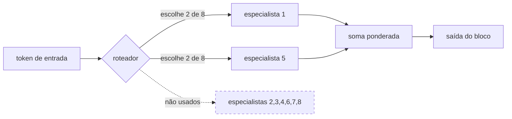
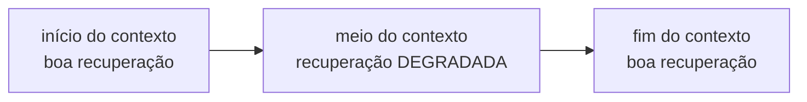
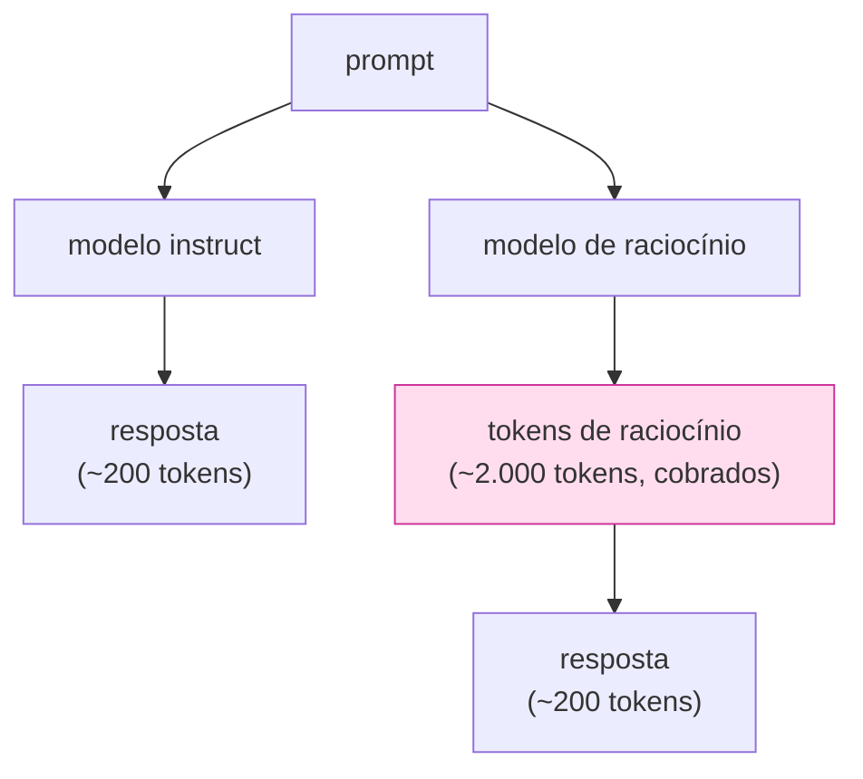
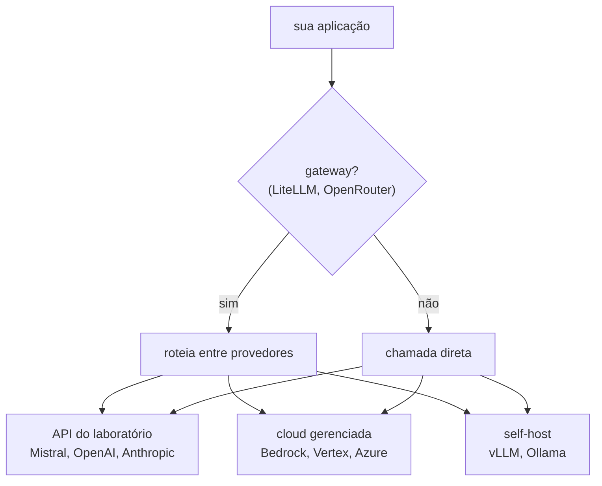

# IA Aplicada com LLMs — Aula 02: Escolha e configuração de modelos — Escolhendo um modelo

## Introdução

Na Aula 01 havia exatamente uma linha de código que escolhia um modelo:

```python
model="mistral-small-latest"
```

Ninguém questionou. Era a Aula 01, o objetivo era ver o texto aparecer na tela, e qualquer modelo servia. A partir de agora essa linha é uma **decisão de arquitetura** — e das caras. Ela determina, ao mesmo tempo, a qualidade das respostas do seu sistema, a conta que chega no fim do mês, quanto o usuário espera antes de ver a primeira palavra, quais dados saem da sua rede e se o seu código continuará funcionando em seis meses.

O problema é que a pergunta "qual é o melhor modelo?" não tem resposta. Tem só respostas erradas. A pergunta que tem resposta é:

> *Qual modelo, com quais configurações, atende ao meu requisito de qualidade nesta tarefa, dentro do meu orçamento de custo e de latência, com a política de dados que eu preciso respeitar?*

Essa pergunta tem quatro eixos, e esta nota é sobre os dois primeiros: **o que diferencia um modelo de outro** e **onde ele roda**. Custo e latência ganharam nota própria ([`04-custo-latencia-e-decisao.md`](04-custo-latencia-e-decisao.md)), porque envolvem medição.

Uma advertência que vale para as quatro notas: **este material não decora nomes de modelo.** Qualquer lista de "melhores modelos" escrita hoje está desatualizada no semestre que vem. O que não envelhece são os *eixos* de comparação e o *método* de decidir. É isso que você leva daqui.

> **Pré-requisitos:** Aula 01, especialmente [`01-redes-neurais-e-transformer.md`](../../aula-01-llms-e-agentes/notas-de-aula/01-redes-neurais-e-transformer.md) (o que são os parâmetros de um modelo e por que a atenção custa quadrático no contexto) e [`02-llms-tokens-e-tokenizacao.md`](../../aula-01-llms-e-agentes/notas-de-aula/02-llms-tokens-e-tokenizacao.md) (tokens, janela de contexto).

---

## Objetivos de aprendizagem

Ao final desta nota você deve ser capaz de:

- **Decompor** o nome de um modelo em família, versão, tamanho, variante, quantização e *alias*, e dizer o que cada parte implica.
- **Explicar** a relação entre número de parâmetros, qualidade, memória e latência — e por que ela não é linear.
- **Calcular** o tamanho em memória de um modelo dada a quantização, e explicar o que se perde ao quantizar.
- **Explicar** o que a janela de contexto limita, o que acontece perto do limite e por que o histórico "some" em chats longos.
- **Distinguir** um modelo *instruct* de um modelo de **raciocínio**, e um modelo denso de um **MoE**.
- **Diferenciar** *open-weights* de *open-source* e avaliar o risco de engenharia de usar um alias `-latest`.
- **Escolher** entre API de laboratório, cloud gerenciada, self-host e gateway a partir de um requisito dado.

---

## Desenvolvimento teórico

### 1. "Modelo" não é uma coisa só

Comece pelo mais concreto: o nome. Nomes de modelo parecem arbitrários, mas quase sempre codificam informação. Compare:

| Nome | Família | Tamanho | Variante | Quantização | Versão |
|---|---|---|---|---|---|
| `mistral-small-latest` | Mistral | "small" (nome comercial) | instruct | — (serviço) | alias móvel |
| `ministral-3b-latest` | Ministral | 3 bilhões de parâmetros | instruct | — (serviço) | alias móvel |
| `magistral-small-latest` | Magistral | "small" | **raciocínio** | — (serviço) | alias móvel |
| `codestral-latest` | Codestral | — | **código** | — (serviço) | alias móvel |
| `llama3.1:8b-instruct-q4_K_M` | Llama 3.1 | 8 bilhões | instruct | **Q4** | fixa |
| `qwen2.5-coder:7b` | Qwen 2.5 | 7 bilhões | **código** | Q4 (padrão do Ollama) | fixa |

Duas observações importantes já saem daí.

**Primeira:** quando você usa uma **API**, a quantização é escolha do provedor, não sua — ele não te conta com quantos bits está servindo o modelo, e pode mudar isso sem avisar. Quando você **hospeda** o modelo, a quantização é sua e é uma das decisões de maior impacto. Voltamos a isso na seção 3.

**Segunda:** os nomes comerciais ("small", "medium", "large") são **relativos à família e ao momento**. O "small" de um laboratório pode ser maior que o "large" de outro, e o "small" deste ano é maior que o "medium" de dois anos atrás. Nome comercial não é unidade de medida. Sempre que puder, procure o número de parâmetros real na *model card*.

#### 1.1 Não decore: pergunte

O catálogo é dado vivo. O primeiro script do laboratório existe só para isso:

```python
# codigo/aula02-modelos-e-parametros/00-catalogo-modelos.py (trecho)
resposta = client.models.list()

for modelo in sorted(resposta.data, key=lambda m: m.id):
    extras = modelo.model_extra or {}
    print(modelo.id, extras.get("max_context_length"), extras.get("capabilities"))
```

Isso responde três perguntas de uma vez: **quais** modelos a sua chave enxerga (não são os mesmos para todo mundo — depende do plano), **qual o contexto** de cada um, e **quem suporta *function calling*** — a capacidade que a Aula 03 vai exigir e que nem todo modelo tem.

Guarde o hábito: antes de fixar um nome de modelo no código, pergunte ao provedor o que existe hoje.

---

### 2. Número de parâmetros

#### 2.1 O que estamos contando

Na Aula 01, Parte 1, você viu que um Transformer é feito de matrizes: projeções de atenção ($W_Q$, $W_K$, $W_V$, $W_O$), as duas camadas da rede *feed-forward* de cada bloco, a matriz de *embeddings*. **Parâmetro é cada número dentro dessas matrizes** — cada peso aprendido no treino.

Quando se diz que um modelo tem "7B", são 7 bilhões desses números. É uma medida de **capacidade**: quanta estrutura estatística do texto o modelo consegue armazenar.

Ordens de grandeza que ajudam a calibrar:

| Escala | Exemplos típicos | Onde roda | Serve para |
|---|---|---|---|
| **0,5B – 3B** | `qwen2.5:0.5b`, Ministral 3B | notebook, celular, borda | classificação, extração simples, roteamento, esboço |
| **7B – 13B** | Mistral 7B, Llama 3.1 8B | uma GPU de consumo (quantizado) | uso geral, resumo, RAG simples, chat |
| **24B – 70B** | Mistral Small 3, Llama 3.1 70B | GPU de datacenter ou API | raciocínio de várias etapas, código, tarefas difíceis |
| **100B+** | Mistral Large (~123B), modelos de fronteira | API, cluster | o que os menores erram |

#### 2.2 Por que "maior" não é a resposta automática

Três razões, e nenhuma é sentimental.

**A qualidade cresce com retornos decrescentes.** As leis de escala (Kaplan et al., 2020; Hoffmann et al., 2022 — o *Chinchilla*) descrevem a perda caindo como uma **lei de potência** no tamanho: dobrar os parâmetros não dobra a qualidade, melhora um pouco. O trabalho do Chinchilla ainda mostrou algo mais interessante: modelos da época estavam **grandes demais para os dados que viram**. Com o mesmo orçamento de computação, um modelo *menor* treinado com *mais* dados era melhor. Foi essa descoberta que abriu a era dos modelos de 7B–8B surpreendentemente bons — e é por isso que "número de parâmetros" sozinho não ordena qualidade entre famílias diferentes. Um 8B moderno bate um 70B de três anos atrás em muita coisa.

**A tarefa tem um teto.** Se a sua tarefa é "esta mensagem é uma reclamação, um elogio ou uma dúvida?", um modelo de 3B acerta praticamente tanto quanto um de 123B. Você estaria pagando 40× mais pela mesma resposta. A pergunta certa não é "qual é o melhor modelo?" e sim **"qual é o menor modelo que ainda passa no meu teste?"** — e note que essa pergunta pressupõe que você *tem* um teste. É o benchmark próprio da nota 04.

**Grande custa em três moedas.** Dinheiro por token, latência por token e memória para hospedar. Em um agente, que faz N chamadas por tarefa, os três se multiplicam por N.

#### 2.3 Denso × MoE: parâmetros totais e parâmetros ativos

Uma sutileza que muda a leitura da tabela acima. Modelos **densos** usam todos os parâmetros em toda inferência. Modelos **mixture-of-experts (MoE)** têm muitos parâmetros, mas ativam só uma fração por token: a rede *feed-forward* de cada bloco é substituída por várias "especialistas", e um roteador escolhe duas (por exemplo) para cada token.

O Mixtral 8x7B é o exemplo canônico: cerca de **47B de parâmetros totais**, mas apenas **~13B ativos** por token.



Consequência prática, e é bem concreta: um MoE ocupa memória de **modelo grande** (você precisa ter todos os especialistas carregados, porque não sabe quais serão escolhidos) e roda na velocidade de **modelo médio** (só os ativos participam da conta). Para quem consome por API, isso significa preço frequentemente melhor do que o tamanho total sugeriria. Para quem hospeda, significa uma conta de VRAM desagradável.

Às vezes o próprio nome já avisa. A tag `qwen3.5:35b-a3b` quer dizer **35B totais, 3B ativos** (`a` de *active*) — a nomenclatura distingue as duas contas justamente porque elas dizem coisas diferentes: a primeira é a memória que você precisa, a segunda é a velocidade que você obtém.

Guarde também um detalhe que volta na nota 02: **o roteamento de MoE depende de como as requisições foram agrupadas em lote**, e é uma das razões pelas quais `temperature=0` não garante saída idêntica.

---

### 3. Quantização

#### 3.1 A conta

Um parâmetro é um número real, e número real ocupa espaço. A **quantização** reduz a precisão com que cada peso é guardado: em vez de 32 bits por número, use 16, 8 ou 4.

A conta é direta:

$$\text{memória} \approx \text{n}^\text{o}\text{ de parâmetros} \times \frac{\text{bits por parâmetro}}{8}$$

Para um modelo de 7 bilhões de parâmetros:

| Precisão | Bits/param | Tamanho (7B) | Perda de qualidade | Uso típico |
|---|---|---|---|---|
| float32 (FP32) | 32 | ~28 GB | nenhuma | treino, referência |
| float16 / bfloat16 | 16 | ~14 GB | desprezível | padrão de inferência em datacenter |
| int8 (Q8) | 8 | ~7 GB | pequena | inferência eficiente |
| Q4 (4 bits) | 4 | ~3,5 GB | moderada, perceptível em tarefas difíceis | rodar em notebook/GPU de consumo |

> Confira a aritmética: $7 \times 10^9 \times 4 \text{ bytes} = 28 \times 10^9$ bytes ≈ 28 GB. É por isso que um modelo de 7B em FP32 não cabe numa GPU de 24 GB, e em Q4 cabe folgado até em CPU com RAM comum.

**Os modelos que o Ollama baixa vêm quantizados em Q4 por padrão.** Isso explica um fenômeno que confunde muito aluno: o "mesmo" modelo parece mais burro localmente do que na API. Muitas vezes não é o mesmo modelo — é a versão de 4 bits dele.

E há um segundo efeito, que quase nunca é mencionado: **quantizar também deixa a geração mais rápida.** A razão não é aritmética, é **banda de memória**. Para produzir *cada* token, o hardware precisa ler os pesos da memória — e gerar é serial, um token por vez (Aula 01, Parte 2, §3). Metade dos bytes por peso significa metade do tráfego de memória por token, e a geração acelera quase na mesma proporção. Numa GPU, gerar texto é limitado por leitura de memória, não por capacidade de cálculo.

Some os dois efeitos e você tem o resumo do trade-off: quantizar compra **memória e velocidade** pagando com **qualidade**. Quanto de cada, é medição.

#### 3.2 Decodificando o nome: o que "Q4_K_M" quer dizer

Baixando modelo você vai encontrar tags assim, e elas não são enigmas:

```
qwen3.5:0.8b-q4_K_M
                │ │ │
                │ │ └── variante: S (small), M (medium) ou L (large)
                │ └──── família do esquema: K-quant
                └────── bits nominais por peso
```

| Parte | Significa |
|---|---|
| `q` | *quantized* — os pesos não estão em ponto flutuante cheio |
| `4` | **bits nominais** por peso. É o número da tabela acima |
| `K` | **K-quant**: os pesos são divididos em blocos, cada bloco guarda a própria escala, e algumas camadas ficam com mais bits que o nominal |
| `M` | dentro do K-quant, **quanta coisa** fica em precisão mais alta. `S` < `M` < `L`: mais qualidade, mais bytes |

E o outro formato que aparece muito:

| Tag | Significa |
|---|---|
| `q8_0` | 8 bits no esquema **legado** (não-K). O `_0` é a variante mais simples: um fator de escala por bloco, sem deslocamento |
| `q4_1` | idem em 4 bits, mas guardando escala **e** deslocamento por bloco — um pouco melhor e um pouco maior que o `_0` |
| `bf16` | **sem** quantização: 16 bits de ponto flutuante (*bfloat16*), os pesos como o modelo foi treinado. No Ollama a tag se chama `bf16` — **não existe `fp16`** |
| `int4`, `int8` | inteiro puro, sem os blocos com escala do K-quant |
| `mxfp8`, `nvfp4` | formatos de ponto flutuante **microescalado**, mais recentes, de 8 e 4 bits |
| `mlx` | não é quantização: é um *build* para o **Apple MLX**, o runtime de Apple Silicon |

Duas consequências práticas, e a segunda é a que pega todo mundo:

**1. `q4_K_M` é o padrão de fato** porque é o melhor ponto da curva qualidade × tamanho para a maioria dos casos. Quando uma tag não diz a quantização (`qwen3.5:0.8b`, sem sufixo), ela aponta para *alguma* — frequentemente Q4, mas não sempre; naquele modelo específico, é Q8_0. **Confirme, não suponha:** `ollama show <modelo>` informa na linha `quantization`.

E não suponha que a tag *existe*: **nem todo tamanho tem todas as quantizações.** No Qwen 3.5, o `2b` tem `q4_K_M`, `q8_0` e `bf16`; o `0.8b` **não tem `q4_K_M`**. Pedir uma tag inexistente falha com `pull model manifest: file does not exist` — consulte a página de *tags* da família antes.

**2. Os bits nominais são um piso, não a previsão.** Se o `K` guarda camadas em precisão mais alta e cada bloco carrega a escala dele, o arquivo gasta **mais** que $\text{params} \times \text{bits} / 8$. Quanto? Medindo três modelos reais:

| Modelo | Params | Tag | Disco | Bits/param **real** | Nominal |
|---|---|---|---|---|---|
| Qwen3.6 (MoE) | 36,0 B | `q4_K_M` | 23 GB | **5,1** | 4 |
| Qwen3.5 | 873 M | `q8_0` | 1,0 GB | **9,2** | 8 |
| Qwen2.5 | 494 M | `q4_K_M` | 397 MB | **6,4** | 4 |

Compare os dois `q4_K_M`: o modelo de 36B gasta 28% acima do nominal, o de 0,5B gasta **60%** acima. O motivo é bom de guardar: a matriz de *embeddings* é mantida em precisão alta, e num modelo pequeno ela é uma fatia enorme do total — num 0,5B com vocabulário grande, pode passar de um quarto de todos os parâmetros. **Modelo pequeno é proporcionalmente mais incompressível.**

Ou seja: a tabela da §3.1 é uma estimativa otimista. Use-a para saber a ordem de grandeza, e o `ollama list` para saber o tamanho.

#### 3.3 O que se perde

Quantizar é arredondar. Os pesos deixam de assumir qualquer valor e passam a assumir valores de uma grade discreta (as técnicas modernas são mais espertas que isso — agrupam pesos em blocos com escala própria, guardam as camadas sensíveis com mais bits —, mas a ideia é essa). O erro de arredondamento se acumula ao longo de dezenas de camadas.

O efeito raramente é "o modelo para de funcionar". É mais insidioso:

- respostas curtas e fáceis continuam boas — você não percebe nada;
- tarefas de várias etapas degradam primeiro (raciocínio, código longo, aderência a formato);
- a **cauda** piora: o modelo erra mais nos casos difíceis, que são justamente os que você não testou.

Daí a regra: **se você quantizou, meça de novo.** Nunca assuma que o resultado do modelo em FP16 vale para a versão Q4 dele.

#### 3.4 Quando isso importa para você

Se você consome por **API**, quantização é problema do provedor: você paga por token e não controla (nem enxerga) os bits. Ela vira sua decisão no momento em que você **hospeda** o modelo — e aí é a alavanca que decide se cabe ou não na GPU que você tem. Regra de bolso para self-host: some ao tamanho do modelo uns 20–30% de folga para o **cache de KV** (o cache de chaves e valores da atenção, que cresce com o contexto e com o número de conversas simultâneas) e para o *overhead* do runtime.

---

### 4. Janela de contexto

Você já viu o conceito na Aula 01. Aqui interessam as consequências práticas de escolher um modelo por esse eixo.

#### 4.1 O que ela limita

A janela é o limite de tokens que o modelo processa **de uma vez** — e o número inclui **entrada e saída juntas**. Um modelo com janela de 32 mil tokens e um prompt de 31.500 tokens tem 500 tokens para responder, e nem sempre o erro é claro: você pode receber uma resposta truncada com `finish_reason="length"` (veja a nota 02) ou um erro do provedor.

#### 4.2 O custo escondido de contexto longo

Da Aula 01, Parte 1: a atenção compara cada token com todos os anteriores, então o custo cresce com o **quadrado** do comprimento. Dobrar o contexto multiplica o trabalho de atenção por quatro. Os provedores absorvem parte disso com otimizações, mas duas coisas sobram para você:

- **você paga por token de entrada**, então um prompt de 100 mil tokens custa 100× um de mil — a cada chamada, e um agente faz muitas;
- **o TTFT cresce**: quanto maior o prompt, mais o usuário espera pela primeira palavra.

**TTFT** (*time to first token*) é o tempo entre você enviar a requisição e a **primeira palavra** aparecer na tela. Ele merece um nome próprio porque não é a mesma coisa que o tempo total da resposta: antes de gerar o primeiro token, o modelo precisa processar o **prompt inteiro** de uma vez (a fase de *prefill*) — e é justamente esse trabalho que cresce com o tamanho do contexto. Depois disso, os tokens saem num ritmo mais ou menos constante, medido em tokens por segundo.

Para o usuário, o TTFT é o número que importa: é ele que separa "respondeu" de "travou". Um sistema com TTFT de 4 segundos parece quebrado mesmo que a resposta completa chegue rápido depois. Os três números de latência — TTFT, tokens/s e tempo total — e como medir cada um estão na [nota 04, §5](04-custo-latencia-e-decisao.md).

"Janela de 1 milhão de tokens" é um número de marketing sobre o que é *possível*, não sobre o que é *recomendável*.

#### 4.3 Perto do limite, a qualidade cai antes do erro

Um modelo não usa a janela toda com a mesma competência. O trabalho *Lost in the Middle* (Liu et al., 2023) mostrou um padrão que se repete: a informação no **começo** e no **fim** do contexto é recuperada bem; a que está no **meio** é sistematicamente pior aproveitada — um viés em forma de U.



Consequências de projeto, que voltam com força na aula de RAG:

- coloque a instrução crítica **no começo ou no fim**, nunca soterrada no meio;
- mais contexto **não é** melhor: encher a janela com documentos "por precaução" piora o resultado e aumenta o custo;
- se você precisa de 20 documentos, o problema é de **recuperação** (achar os 3 certos), não de janela.

#### 4.4 O comportamento perigoso: histórico que some

O modelo é uma função sem estado — quem mantém o histórico é o seu programa. Quando a conversa cresce e passa da janela, alguma coisa tem que ser descartada. Muitos frameworks e interfaces descartam as mensagens mais antigas **silenciosamente**.

O resultado é o sintoma clássico: *"o chatbot esqueceu o que eu falei no começo"* — e, pior, não há erro nenhum no log. Se você não implementou resumo de histórico ou uma janela deslizante explícita, você tem essa bomba armada. Isso não é um defeito do modelo; é uma decisão de engenharia que alguém tomou por você.

---

### 5. Modalidade e especialização: um modelo por trabalho

Modelos de propósito geral cobrem bem o caso médio. Fora dele, existem variantes treinadas para um trabalho específico, e elas costumam ser **melhores e mais baratas** que o modelo grande genérico:

| Especialização | Para que serve | Observação |
|---|---|---|
| **Instruct / chat** | o padrão: seguir instruções em diálogo | é o que você usou na Aula 01 |
| **Código** (Codestral, Qwen Coder) | completar, explicar e corrigir código | treinado com mais código e com *fill-in-the-middle* |
| **Raciocínio** (Magistral, família "thinking") | problemas de várias etapas | seção 6 |
| **Embeddings** | transformar texto em vetor | **não gera texto**; é a base da Aula 06 (busca semântica) |
| **Visão / multimodal** (Pixtral) | imagem + texto na mesma entrada | OCR, gráficos, capturas de tela |
| **Moderação / guardrail** | classificar conteúdo | usado *em volta* do modelo principal, na aula de segurança |

O erro comum aqui é achar que precisa do modelo maior porque "a tarefa é difícil". Muitas vezes a tarefa não é difícil — é **específica**, e existe um modelo pequeno especializado nela.

---

### 6. Instruct × raciocínio

Um modelo *instruct* responde direto: recebe o prompt e começa a emitir a resposta. Um modelo de **raciocínio** primeiro gera uma cadeia de pensamento — potencialmente longa — e só depois a resposta.



#### 6.1 Duas tarefas, lado a lado

A diferença fica clara com exemplos concretos. As duas tarefas abaixo têm enunciados de tamanho parecido e as duas são "de trabalho" — mas pedem coisas diferentes do modelo.

**Tarefa de instruct** — reescrever uma mensagem:

> *"Reescreva esta mensagem num tom formal, para enviar a um cliente: 'oi, o pedido tá atrasado, deu ruim com a transportadora, deve chegar semana que vem'."*

O modelo lê o pedido e **já sabe o que fazer**. Não existe nada a calcular antes de começar a escrever: a resposta é uma **transformação** do texto de entrada, produzida em uma passagem. Ele começa a emitir "Prezado cliente, informamos que..." no primeiro token e segue até o fim. É a mesma natureza de tarefa em resumo, tradução, classificação, extração, geração de texto e reescrita — **a maior parte do trabalho de um sistema de LLM**.

**Tarefa de raciocínio** — decidir uma compra:

> *"Uma loja vende canetas em caixas de 12 por R$ 30 a caixa e avulsas por R$ 3,50. Preciso de 100 canetas gastando o mínimo possível. Quantas caixas e quantas avulsas devo comprar, e qual o total?"*

Aqui não há transformação nenhuma a fazer: há um **resultado a descobrir**, e ele depende de resultados intermediários que ninguém deu de graça. O caminho é mais ou menos este:

1. caneta na caixa custa $30 / 12 = 2{,}50$; avulsa custa $3{,}50$ — logo, caixa é mais barata por caneta;
2. então maximizar caixas: $8 \times 12 = 96$ canetas por $8 \times 30 = 240$ reais;
3. faltam 4 canetas. Duas opções: 4 avulsas ($4 \times 3{,}50 = 14$, total **254**) ou uma nona caixa ($+30$, total **270**);
4. comparar: 254 < 270 → **8 caixas e 4 avulsas, R$ 254**.

Repare no passo 3: é uma **armadilha**, e ela é o motivo pelo qual a tarefa exige raciocínio. A regra descoberta no passo 1 ("caixa é mais barata") sugere comprar a nona caixa — e, aplicada sem pensar, dá a resposta errada. Só a comparação explícita entre as duas alternativas resolve. Um modelo *instruct* pressionado a responder direto costuma tropeçar exatamente aí: acerta o raciocínio geral e erra o fecho.

#### 6.2 O critério: quantas etapas, não quão difícil

O teste que serve na prática é uma pergunta única:

> **A resposta depende de um resultado intermediário que eu também preciso descobrir?**

Se sim, é tarefa de raciocínio. Se a resposta é uma transformação direta da entrada, é tarefa de instruct.

E o mais importante: **dificuldade não é o critério.** Compare:

| Tarefa | Parece | É | Por quê |
|---|---|---|---|
| Escrever um soneto em decassílabos sobre logística | difícil | **instruct** | exige repertório, não etapas: uma passagem só |
| Traduzir um contrato técnico de 5 páginas | difícil | **instruct** | transformação, repetida muitas vezes |
| "Se todo A é B e nenhum B é C, algum A pode ser C?" | fácil | **raciocínio** | uma linha de enunciado, três passos de dedução |
| Escolher entre 3 fretes com prazo, preço e multa | fácil | **raciocínio** | precisa comparar combinações antes de responder |

As duas primeiras linhas são o erro caro: gastar tokens de raciocínio em tarefa de redação. As duas últimas são o erro silencioso: mandar tarefa de dedução para um modelo que responde de imediato, e receber uma resposta fluente e errada.

#### 6.3 O preço de pensar

A ideia por trás disso tem nome: **test-time compute**. Em vez de gastar mais no treino (modelo maior), gasta-se mais **na hora da inferência**, deixando o modelo "pensar" antes de responder. Funciona — em tarefas de várias etapas, é uma diferença real de acerto.

O que quase ninguém conta na primeira aula é o preço:

- **os tokens de raciocínio são cobrados** como tokens de saída, que são a parte cara;
- **a latência aumenta muito**, e o streaming não salva: o usuário fica esperando o pensamento terminar antes de ver a resposta;
- **em tarefa simples não melhora nada** — só encarece. Perguntar a capital da França a um modelo de raciocínio é queimar dinheiro em latência.
- e há uma armadilha operacional: se o `max_tokens` acabar no meio do raciocínio, **você paga tudo e não recebe resposta nenhuma**.

Regra prática que serve para o resto do curso: **raciocínio para decidir, instruct para redigir.** O script [`07-raciocinio.py`](https://github.com/celsocrivelaro/senac-llm-code/blob/main/aula02-modelos-e-parametros/07-raciocinio.py) mede exatamente esse trade-off nas duas situações.

---

### 7. Licença e ciclo de vida

Dois riscos de engenharia que não aparecem em nenhum *benchmark*.

#### 7.1 Open-weights não é open-source

A confusão é generalizada e tem consequência jurídica:

| Termo | O que você recebe | O que normalmente **não** recebe |
|---|---|---|
| **Open-source** (no sentido estrito) | pesos, código, dados e receita de treino, com licença livre | — |
| **Open-weights** | os **pesos** para baixar e rodar | os dados de treino, a receita completa, e às vezes o direito de uso comercial |
| **Proprietário** | acesso por API | qualquer coisa que você possa hospedar |

A maioria do que se chama de "modelo aberto" é **open-weights**, e a licença varia bastante entre eles: alguns são Apache 2.0 (uso comercial liberado — caso do Mistral 7B, do Mixtral e do Mistral NeMo), outros vêm com licença de pesquisa que **proíbe uso comercial** sem contrato, e a licença da família Llama tem cláusulas próprias, incluindo um limite de usuários mensais acima do qual é preciso negociar. **Leia a licença do modelo específico antes de colocar em produto** — e leia a versão dela que está na *model card* hoje, não a que você leu no ano passado.

#### 7.2 O alias `-latest` é uma dependência sem versão

`mistral-small-latest` não é um modelo: é um **ponteiro** para o modelo que o provedor considera atual. Quando ele atualiza, o seu código passa a chamar outra coisa — sem você mudar uma linha.

É exatamente a situação que a engenharia de software resolveu há décadas com *lockfile*. Trate do mesmo jeito:

| Ambiente | Recomendação |
|---|---|
| Aula, protótipo, exploração | alias `-latest` — conveniência vale mais que estabilidade |
| Produção | **versão datada fixa** + testes de regressão antes de migrar |

E some a isso a **deprecação**: modelos são desligados. O provedor anuncia, dá um prazo, e depois a chamada falha. Um sistema de LLM em produção precisa de um plano de migração de modelo do mesmo jeito que precisa de um plano de migração de banco. Voltamos a isso na aula de produção.

---

### 8. Onde o modelo roda

Escolhido o modelo, falta decidir **de onde** ele vai atender. São quatro modos, e a escolha muda custo, privacidade, latência e trabalho de operação.



| Modo | Custo | Privacidade | Operação | Quando escolher |
|---|---|---|---|---|
| **API do laboratório** | por token, zero fixo | os dados vão para o provedor (leia a política de retenção) | quase nenhuma | protótipo, volume baixo/médio, acesso ao melhor modelo disponível |
| **Cloud gerenciada** (Bedrock/Vertex/Azure) | por token, geralmente mais caro | fica dentro do seu contrato de nuvem e da sua região | pouca | a empresa já tem contrato/compliance com a nuvem |
| **Self-host** (vLLM, Ollama) | GPU por hora, **independe** do volume | os dados **não saem** da sua infraestrutura | muita (GPU, escala, atualização, *uptime*) | volume alto e constante, dado sensível, ou exigência regulatória |
| **Gateway** (LiteLLM, OpenRouter) | o do destino + margem | depende do destino | pouca | trocar de provedor sem mudar código, roteamento, *failover*, controle central de custo |

Sobre o **ponto de virada** do self-host: ele existe, mas raramente onde as pessoas acham que está. Uma GPU de datacenter alugada custa alguns dólares por hora — e roda 24 horas por dia, com ou sem tráfego. Uma API só cobra quando você chama. Carga esporádica quase sempre sai mais barata por API; carga alta e **constante** é onde o self-host começa a compensar. Faça a conta com o seu volume real (é o exercício da nota 04) antes de decidir por instinto.

#### 8.1 A boa notícia: a interface virou padrão

Repare no que você faz para trocar tudo isso de lugar:

```python
# API da Mistral (o que usamos no curso)
client = OpenAI(base_url="https://api.mistral.ai/v1",
                api_key=os.environ["OPENAI_API_KEY"])
modelo = "mistral-small-latest"

# Ollama local — mesmo código, outro endereço
client = OpenAI(base_url="http://localhost:11434/v1", api_key="ollama")
modelo = "qwen2.5:0.5b"

# Gateway (LiteLLM/OpenRouter) — idem
client = OpenAI(base_url="https://openrouter.ai/api/v1",
                api_key=os.environ["OPENROUTER_API_KEY"])
modelo = "meta-llama/llama-3.1-8b-instruct"
```

O formato `chat/completions` virou o denominador comum do mercado — quase todo provedor oferece um endpoint compatível. **Isso é uma decisão de arquitetura disponível de graça:** se você isolar a criação do cliente e o nome do modelo em um único lugar (configuração, variável de ambiente, fábrica), trocar de provedor é mudar duas linhas. Se você espalhar `client.chat.completions.create(model="mistral-small-latest", ...)` por trinta arquivos, você se amarrou sem precisar.

A ressalva importante: **compatível não é idêntico.** O que varia é justamente o que a nota 02 vai explorar — quais parâmetros são aceitos, como se chamam, o que é ignorado em silêncio. Portabilidade da chamada não é portabilidade do comportamento.

#### 8.2 Rate limits: o erro que aparece na aula prática

Provedores limitam requisições por minuto e tokens por minuto. Estourado o limite, vem `429 Too Many Requests`.

Isso vai acontecer com a turma inteira chamando a mesma API ao mesmo tempo. O tratamento correto é **backoff exponencial** — esperar 1s, 2s, 4s, 8s antes de tentar de novo:

```python
import time
from openai import RateLimitError

def chamar_com_retry(client, tentativas=5, **kwargs):
    for tentativa in range(tentativas):
        try:
            return client.chat.completions.create(**kwargs)
        except RateLimitError:
            espera = 2 ** tentativa            # 1, 2, 4, 8, 16 segundos
            print(f"429 — aguardando {espera}s")
            time.sleep(espera)
    raise RuntimeError("estourou as tentativas")
```

Guarde esse padrão: ele reaparece em toda aplicação de LLM em produção, e vira requisito obrigatório quando um agente faz dezenas de chamadas por tarefa.

---

## Exemplos

### Exemplo 1 — Cabe na minha GPU?

Você tem uma placa de 16 GB e quer hospedar um modelo de 8B.

**Passo 1 — tamanho dos pesos por precisão:**

$$8 \times 10^9 \times \frac{16}{8} = 16\,\text{GB (FP16)} \qquad 8 \times 10^9 \times \frac{8}{8} = 8\,\text{GB (int8)} \qquad 8 \times 10^9 \times \frac{4}{8} = 4\,\text{GB (Q4)}$$

**Passo 2 — descontar a folga.** Além dos pesos, a GPU precisa do cache de KV (cresce com o contexto e com as requisições simultâneas), das ativações e do *overhead* do runtime. Reserve 20–30%.

**Passo 3 — decidir:**

| Precisão | Pesos | + 25% de folga | Cabe em 16 GB? |
|---|---|---|---|
| FP16 | 16 GB | 20 GB | ❌ não |
| int8 | 8 GB | 10 GB | ✅ sim, com espaço para contexto |
| Q4 | 4 GB | 5 GB | ✅ sim, com folga grande |

**Conclusão:** FP16 não cabe. int8 é a escolha equilibrada. Q4 cabe folgado e permite contexto maior ou mais usuários simultâneos, **ao custo de qualidade que você precisa medir** — não assuma que a versão Q4 mantém o resultado que você validou em FP16.

### Exemplo 2 — Trocar de provedor sem tocar na lógica

O anti-padrão e a correção:

```python
# RUIM — provedor e modelo espalhados pelo código
def resumir(texto):
    client = OpenAI(base_url="https://api.mistral.ai/v1",
                    api_key=os.environ["OPENAI_API_KEY"])
    return client.chat.completions.create(
        model="mistral-small-latest",
        messages=[{"role": "user", "content": f"Resuma: {texto}"}],
    ).choices[0].message.content
```

```python
# BOM — um único lugar decide provedor e modelo
import os
from functools import lru_cache
from openai import OpenAI

@lru_cache(maxsize=1)
def get_client():
    return OpenAI(
        base_url=os.environ.get("LLM_BASE_URL", "https://api.mistral.ai/v1"),
        api_key=os.environ["OPENAI_API_KEY"],
    )

MODELO_PADRAO = os.environ.get("LLM_MODELO", "mistral-small-latest")

def resumir(texto, modelo=MODELO_PADRAO):
    return get_client().chat.completions.create(
        model=modelo,
        messages=[{"role": "user", "content": f"Resuma: {texto}"}],
    ).choices[0].message.content
```

Com a segunda versão, rodar tudo no Ollama para desenvolver sem gastar é `export LLM_BASE_URL=http://localhost:11434/v1`. E acrescentar um segundo nome de modelo aqui — um barato para o caso fácil, um bom para o difícil — é literalmente como começa o **roteamento** da nota 04.

Não é exemplo de brochura: **é assim que o laboratório desta aula está escrito.** Os scripts `00` a `05` não têm endereço de API nem nome de modelo no código — leem essas duas variáveis do `.env`, com o padrão embutido.

A prova de que a portabilidade é real está em dois arquivos do repositório de código, com a mesma lista de variáveis e valores diferentes: [`.env.example`](https://github.com/celsocrivelaro/senac-llm-code/blob/main/.env.example) aponta para a API da Mistral, [`.env.ollama`](https://github.com/celsocrivelaro/senac-llm-code/blob/main/.env.ollama) aponta para um modelo rodando na sua máquina. Trocar de provedor é `cp .env.ollama .env` — nenhuma linha de código muda.

E repare na exceção, porque ela ensina o outro lado da regra: nos scripts `06` e `07`, os nomes dos modelos estão **fixos no código**. Não é descuido. Configuração é o que muda entre ambientes sem mudar o que o programa faz — o endpoint, a chave, o modelo padrão. Ali, o modelo é o **objeto do experimento**: o `06` compara pequeno, médio e grande com o preço de cada um ao lado, e uma tabela de custo em que ninguém sabe quais modelos entraram não vale nada. **Nem tudo que é um valor literal é configuração.**

---

## Exercícios resolvidos

### 1. Qual modelo para cada requisito?

**Enunciado.** Escolha o *tipo* de modelo (não o nome comercial) e o modo de hospedagem para:

**(a)** Classificar 2 milhões de mensagens de suporte por dia em 5 categorias.
**(b)** Um assistente jurídico interno que lê contratos confidenciais da empresa.
**(c)** Um chat de atendimento com 50 conversas simultâneas em horário comercial.

**Resolução.**

**(a) Modelo pequeno (1B–3B), especializado por prompt curto, provavelmente self-host.** A tarefa é fechada e fácil: classificar em 5 rótulos tem teto baixo de dificuldade, e um modelo pequeno empata com um grande. O volume é o argumento decisivo — 2 milhões de chamadas/dia é carga alta e **constante**, exatamente o cenário em que a GPU parada de madrugada ainda vale a pena. Configure `temperature=0` e saída estruturada (nota 02). Antes de fechar: valide o modelo pequeno num conjunto rotulado à mão; se ele empatar com o grande, a decisão está tomada com evidência.

**(b) Modelo de qualidade alta, self-host ou cloud com contrato — nunca API pública sem avaliar a política de dados.** Aqui o eixo dominante **não é custo, é privacidade**: contrato confidencial saindo da rede da empresa é problema jurídico, não técnico. Se a nuvem contratada já cobre o compliance (Bedrock/Vertex/Azure na região certa), é o caminho de menor esforço. Contexto grande é requisito real — contratos são longos —, mas cuidado com o *lost in the middle*: mesmo com janela sobrando, a resposta melhora se você recuperar as cláusulas relevantes em vez de despejar o contrato inteiro.

**(c) Modelo médio por API, com streaming.** 50 conversas simultâneas em horário comercial é carga **intermitente** — a GPU ficaria ociosa à noite e no fim de semana, então self-host é desperdício. O eixo dominante é **latência percebida**: use streaming e priorize TTFT baixo (nota 04). Como é atendimento, planeje o descarte de histórico explicitamente (§4.4) para o cliente não ouvir "não sei do que você está falando" no meio da conversa.

### 2. Lendo um nome de modelo

**Enunciado.** O que você consegue afirmar sobre `llama3.1:70b-instruct-q4_K_M` antes de rodá-lo? E o que **não** consegue?

**Resolução.**

**Consigo afirmar:**
- Família Llama, versão 3.1 — logo, licença da comunidade Llama, com cláusulas próprias que preciso ler antes de uso comercial.
- 70 bilhões de parâmetros, **denso** (não há indicação de MoE).
- Variante **instruct**: treinado para seguir instruções em diálogo, não é o modelo base.
- Quantizado em **4 bits nominais**, no esquema K-quant de variante média (§3.2). Estimo os pesos em $70 \times 10^9 \times 0{,}5 = 35$ GB — e, pela §3.2, esse número é o **piso**: com o `K_M` guardando camadas em precisão maior, espere algo entre 40 e 45 GB. De qualquer forma, **não cabe** numa GPU de consumo: precisa de placa de datacenter, de duas placas, ou de descarregar parte para a CPU (lento).
- Versão **fixa**: não vai mudar sob os meus pés.

**Não consigo afirmar:**
- **A qualidade na minha tarefa.** Nada no nome diz isso — só medição diz.
- **Quanto a quantização Q4 degradou este modelo específico** nas minhas tarefas difíceis.
- **Qual o tamanho da janela de contexto** configurada no meu runtime (o Ollama, por exemplo, aplica um contexto padrão que pode ser bem menor que o máximo do modelo — e trunca em silêncio).
- **Se suporta *function calling*** de forma confiável no meu runtime.

A lição vale para qualquer modelo: o nome descreve o **artefato**, nunca o **desempenho**.

---

## Síntese

- A linha `model="..."` é uma decisão de arquitetura com quatro eixos: **qualidade na sua tarefa, custo, latência e política de dados**. "Melhor modelo" não é uma pergunta respondível; "menor modelo que passa no meu teste" é.
- Nome de modelo codifica família, tamanho, variante, quantização e versão. Nome comercial ("small", "large") é **relativo à família**, não uma unidade de medida.
- **Não decore o catálogo — consulte-o.** `client.models.list()` diz o que existe hoje, com qual contexto e quais capacidades.
- Mais parâmetros dão retornos **decrescentes** (leis de escala; Chinchilla mostrou que modelos estavam grandes demais para os dados). Um 8B moderno bate um 70B antigo.
- **MoE**: memória de modelo grande, velocidade de modelo médio (Mixtral 8x7B ≈ 47B totais, ~13B ativos). O roteamento sensível ao lote é uma das causas da não-reprodutibilidade.
- **Quantização**: memória ≈ parâmetros × bits/8. Q4 reduz um 7B de 28 GB para ~3,5 GB — e ainda **acelera** a geração, porque gerar token é limitado por banda de memória. A perda aparece **primeiro nas tarefas difíceis** — se quantizou, meça de novo.
- A tag decodifica: `q4_K_M` = 4 bits nominais, esquema **K** (blocos com escala própria, camadas sensíveis com mais bits), variante **M**. Os bits nominais são um **piso**: modelos reais gastam de 28% a 60% mais, e a folga cresce quanto **menor** o modelo — os embeddings não comprimem igual.
- A **janela** limita entrada + saída somadas, custa quadrático em atenção e linear em dinheiro, e a qualidade cai no **meio** do contexto (*lost in the middle*). Mais contexto não é melhor; recuperação melhor é.
- Chat longo estoura a janela e o histórico antigo é descartado **em silêncio** — o famoso "o bot esqueceu". É decisão de engenharia, não defeito do modelo.
- Existe **um modelo por trabalho**: código, embeddings, visão, moderação, raciocínio. O especializado pequeno costuma ganhar do genérico grande na tarefa dele.
- **Raciocínio** gasta tokens cobrados e latência antes de responder: vale em problemas de várias etapas, é desperdício no resto. *Raciocínio para decidir, instruct para redigir.*
- **Open-weights ≠ open-source**, e a licença varia por modelo. O alias `-latest` é dependência sem versão: fixe a versão em produção e tenha plano de migração para deprecação.
- Quatro lugares para rodar — API, cloud gerenciada, self-host, gateway. Self-host só compensa com volume **alto e constante**; privacidade, não custo, é o argumento que mais o justifica.
- A interface `chat/completions` é padrão de fato: isole cliente e nome de modelo em **um** lugar e a portabilidade sai de graça. Compatível, porém, não é idêntico.
- `429` é esperado: implemente **backoff exponencial** desde o primeiro dia.

---

## Fontes e leituras

**Papers**

- Kaplan, J. et al. — *Scaling Laws for Neural Language Models* (2020). [arxiv.org/abs/2001.08361](https://arxiv.org/abs/2001.08361)
- Hoffmann, J. et al. — *Training Compute-Optimal Large Language Models* (2022), o "Chinchilla". [arxiv.org/abs/2203.15556](https://arxiv.org/abs/2203.15556) — por que modelo menor bem treinado vence modelo maior mal treinado.
- Liu, N. F. et al. — *Lost in the Middle: How Language Models Use Long Contexts* (2023). [arxiv.org/abs/2307.03172](https://arxiv.org/abs/2307.03172) — o viés em U da janela de contexto.
- Jiang, A. Q. et al. — *Mixtral of Experts* (2024). [arxiv.org/abs/2401.04088](https://arxiv.org/abs/2401.04088) — parâmetros totais × ativos.
- Dettmers, T. et al. — *QLoRA: Efficient Finetuning of Quantized LLMs* (2023). [arxiv.org/abs/2305.14314](https://arxiv.org/abs/2305.14314) — quantização em 4 bits sem perda catastrófica; volta na aula de fine-tuning.

**Engenharia**

- Documentação da Mistral: [docs.mistral.ai](https://docs.mistral.ai) — catálogo de modelos, capacidades e limites de requisição.
- Preços da Mistral: [mistral.ai/pricing](https://mistral.ai/pricing) — **consulte sempre**; nenhum material impresso sabe o preço de amanhã.
- Ollama model library: [ollama.com/library](https://ollama.com/library) — veja as *tags* de quantização de cada modelo.
- vLLM: [docs.vllm.ai](https://docs.vllm.ai) — o servidor de inferência mais usado em self-host.
- LiteLLM: [docs.litellm.ai](https://docs.litellm.ai) — gateway com interface única para dezenas de provedores.

**Nesta disciplina**

- [Aula 01 — Parte 1](../../aula-01-llms-e-agentes/notas-de-aula/01-redes-neurais-e-transformer.md) — o que são os parâmetros e por que a atenção custa quadrático.
- [Aula 01 — Parte 2](../../aula-01-llms-e-agentes/notas-de-aula/02-llms-tokens-e-tokenizacao.md) — tokens, janela de contexto, o modelo como função sem estado.
- [Nota 02 desta aula](02-configuracoes-da-chamada.md) — os parâmetros da chamada, saída estruturada e determinismo.
- [Nota 03 desta aula](03-controle-da-saida.md) — controle da saída: comprimento máximo, sequências de parada e penalidades.
- [Nota 04 desta aula](04-custo-latencia-e-decisao.md) — a conta de custo, TTFT × tokens/s e a matriz de decisão.
- [`codigo/aula02-modelos-e-parametros/`](https://github.com/celsocrivelaro/senac-llm-code/tree/main/aula02-modelos-e-parametros) — o laboratório desta aula.
