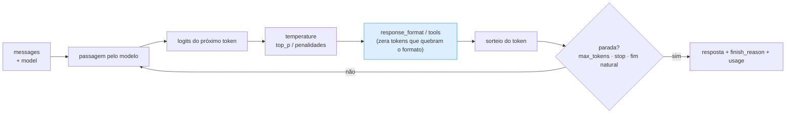
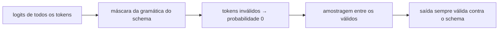

# IA Aplicada com LLMs — Aula 02: Escolha e configuração de modelos — O painel de controle da chamada

## Introdução

A nota anterior escolheu o motor. Esta nota é sobre o painel de controle.

Toda chamada a um LLM carrega, além do texto, um punhado de parâmetros que mudam **como** o modelo escolhe cada token. Você já viu dois deles na Aula 01 — `temperature` e `top_p` — e viu no papel o que eles fazem com a distribuição de probabilidade. Aqui a gente completa o painel, mede o efeito de cada botão em texto de verdade e, principalmente, aprende a **não** girar botão à toa.

Porque esse é o erro característico de quem está começando: tratar os parâmetros como mágica. O texto repetiu? Aumenta a penalidade. Alucinou? Baixa a temperatura. Não seguiu o formato? Mexe no `top_p`. Quase sempre errado. A maior parte dos problemas de saída de LLM é **problema de prompt ou de arquitetura**, não de parâmetro — e girar botões sem medir esconde a causa em vez de resolvê-la.

Esta nota tem, então, dois objetivos que puxam em direções opostas e precisam conviver: mostrar **o que cada parâmetro realmente faz** (com evidência empírica) e mostrar **quando ele não é a resposta**. Fecha com o assunto que mais importa para o resto do curso: **saída estruturada** — o mecanismo que transforma um gerador de texto em um componente de software com contrato, e que é literalmente a base do *tool calling* da Aula 03.

> **Pré-requisitos:** [Aula 01, Parte 2, §3](../../aula-01-llms-e-agentes/notas-de-aula/02-llms-tokens-e-tokenizacao.md) — logits, softmax, temperatura, `top_k`/`top_p` e a armadilha do `temperature=0`. A §1 abaixo recapitula o essencial; o resto é novo.

---

## Objetivos de aprendizagem

Ao final desta nota você deve ser capaz de:

- **Recuperar** o efeito de `temperature` e `top_p` sobre a distribuição de tokens e justificar por que se ajusta **um**, não os dois.
- **Explicar** por que um parâmetro é um **contrato de API** — o que o provedor aceita, o que ele renomeia e o que ele ignora em silêncio.
- **Usar corretamente** `max_tokens`, `stop`, `seed`, `frequency_penalty`, `presence_penalty`, `n` e `stream`, dizendo o que cada um custa.
- **Detectar truncamento** pelo campo `finish_reason` e tratá-lo antes que vire bug distante da causa.
- **Demonstrar empiricamente** que `temperature=0` não garante saída idêntica, e escrever testes por **propriedade** em vez de igualdade.
- **Obter JSON confiável** com `response_format` e JSON Schema, e explicar por que isso é o mecanismo por trás de *tool calling*.
- **Escolher** um conjunto de parâmetros a partir do tipo de tarefa, justificando cada escolha.

---

## Desenvolvimento teórico

### 1. Recapitulando a Aula 01 em três minutos

Todo o painel de amostragem age sobre a mesma coisa: a distribuição de probabilidade do **próximo token**.

A última camada do modelo produz um número real por token do vocabulário — os **logits**. Eles não são probabilidades (podem ser negativos, não somam 1): são a pontuação crua que o modelo atribui a cada candidato, e quanto maior o logit, mais o modelo "prefere" aquele token. Num vocabulário de 32 mil tokens, são 32 mil logits por posição. O **softmax** converte essa pontuação em probabilidade, e a **temperatura** entra dividindo os logits antes da exponencial:

$$P(\text{token}_i) = \frac{e^{z_i / T}}{\sum_j e^{z_j / T}}$$

onde $z_i$ é **o logit** do token $i$ e $T$ é a temperatura. Guarde esse símbolo: $z$ é a notação de logit em todas as fórmulas desta aula.

O efeito é geométrico: $T < 1$ **amplifica** as diferenças (a distribuição fica pontuda, o topo domina); $T > 1$ **encolhe** as diferenças (a distribuição achata, o improvável ganha chance); $T \to 0$ vira `argmax`.

A tabela da Aula 01, para o modelo completando *"O céu estava..."* com logits `[3.2, 2.1, 1.0, 0.2]`:

```
    T     azul    claro    cinza     roxo
  0.1  100.0%     0.0%     0.0%     0.0%
  0.5   88.8%     9.8%     1.1%     0.2%
  1.0   67.0%    22.3%     7.4%     3.3%
  1.5   54.2%    26.0%    12.5%     7.3%
  2.0   46.9%    27.0%    15.6%    10.5%
```

Três conclusões que valem repetir porque tudo nesta nota se apoia nelas:

1. **A temperatura não muda o que o modelo "pensa"** — os logits são os mesmos. Ela muda o quanto ele arrisca ao escolher.
2. **`top_p`** (*nucleus sampling*) corta a cauda de forma adaptativa: ordena por probabilidade e mantém os tokens até acumular $p$ da massa. **`top_k`** faz o mesmo com um número fixo, e é pior justamente por ser fixo. **Ajuste um dos dois, não os dois** — eles interagem de formas difíceis de raciocinar.
3. **`temperature=0` não garante saída idêntica** entre chamadas (lote de tamanho variável, ponto flutuante não associativo, roteamento de MoE, alias de modelo que muda). A §6 mede isso.

Tudo daqui para frente é novo.

---

### 2. Parâmetro é contrato de API, não botão universal

Antes de listar os botões, a lição que economiza mais tempo de depuração no semestre inteiro.

Os parâmetros de amostragem existem no **runtime de inferência**. O que chega até você é o subconjunto que o **provedor** decidiu expor na API dele — com os nomes que ele escolheu. Três situações acontecem o tempo todo:

| Situação | Exemplo real | Como você descobre |
|---|---|---|
| O parâmetro **não existe** na API | `top_k` é padrão em Ollama e vLLM, mas o endpoint `chat/completions` da Mistral não o expõe | lendo a documentação do provedor |
| O parâmetro tem **outro nome** | OpenAI usa `seed`; a Mistral usa `random_seed` | erro 422, ou — pior — silêncio |
| O parâmetro é **aceito e ignorado** | campos desconhecidos que o servidor descarta sem reclamar | **você não descobre**: mede o efeito e vê que não mudou nada |

A terceira é a perigosa. Você acha que configurou algo, o número aparece no seu código, o comportamento não muda, e você atribui isso ao modelo.

O SDK da OpenAI oferece uma válvula de escape para campos específicos do provedor: **`extra_body`**.

```python
resposta = client.chat.completions.create(
    model="mistral-small-latest",
    messages=[{"role": "user", "content": "..."}],
    temperature=0,
    extra_body={"random_seed": 42},   # campo da Mistral que o SDK não conhece
)
```

**Regra de trabalho:** ao trocar de provedor, revalide os parâmetros. Portabilidade da *chamada* (nota 01, §8.1) não é portabilidade do *comportamento*.

---

### 3. Anatomia da requisição

O painel completo do formato `chat/completions`:

| Campo | O que faz | Onde age |
|---|---|---|
| `model` | qual modelo atende | escolha da nota 01 |
| `messages` | o contexto: `system`, `user`, `assistant` | entrada |
| `temperature` | achata/aguça a distribuição | amostragem |
| `top_p` | corta a cauda por massa acumulada | amostragem |
| `frequency_penalty` | desconta logit proporcional à contagem do token | amostragem |
| `presence_penalty` | desconta logit se o token já apareceu | amostragem |
| `seed` / `random_seed` | fixa o gerador aleatório (*best effort*) | amostragem |
| `max_tokens` | teto de tokens **gerados** | parada |
| `stop` | sequências que interrompem a geração | parada |
| `response_format` | impõe formato de saída (JSON / JSON Schema) | decodificação restrita |
| `stream` | devolve token a token | transporte |
| `n` | quantas respostas independentes gerar | amostragem |
| `tools` / `tool_choice` | ferramentas disponíveis (**Aula 03**) | decodificação restrita |



Repare na ordem: `response_format` age **depois** das penalidades e **antes** do sorteio. Ele não pede educadamente que a saída seja JSON — ele torna impossível sortear um token que quebre o formato. É por isso que funciona.

---

### 4. Os parâmetros que a Aula 01 não viu

#### 4.1 `max_tokens` e o campo que quase ninguém lê: `finish_reason`

`max_tokens` é o teto de tokens **gerados** (a entrada não conta). Serve para **controlar custo**, **limitar latência** e **evitar geração desgovernada**.

O problema é o que acontece quando o teto é atingido: a geração **para no meio**, e a resposta chega como se estivesse completa. O JSON vem sem a chave de fechamento, a função Python vem sem o `return`, a frase termina no meio. Se o seu código não checar, o erro vai estourar longe da causa — na desserialização, na gravação do banco, na tela do usuário.

A informação sempre esteve lá:

| `finish_reason` | Significado |
|---|---|
| `"stop"` | o modelo terminou por conta própria (ou bateu numa sequência de `stop`) |
| `"length"` | **bateu no `max_tokens`** — a resposta está truncada |
| `"tool_calls"` | o modelo pediu uma ferramenta (Aula 03) |
| `"content_filter"` | bloqueado por política de conteúdo |

```python
resposta = client.chat.completions.create(
    model=MODELO,
    messages=[{"role": "user", "content": prompt}],
    max_tokens=500,
)
escolha = resposta.choices[0]

if escolha.finish_reason == "length":
    raise ValueError("resposta truncada: aumente max_tokens ou peça saída menor")

conteudo = escolha.message.content
```

Isso deveria ser tão automático quanto checar o *status code* de uma requisição HTTP. O que **nunca** se faz é seguir em frente fingindo que a resposta está completa — é assim que um JSON pela metade chega no banco.

> **Como dimensionar** o `max_tokens`, e por que ele é uma guilhotina e não um pedido de brevidade: [nota 03, §2](03-controle-da-saida.md).

#### 4.2 `stop`: cortar na sua marca

`stop` recebe uma lista de sequências; ao gerar qualquer uma delas, o modelo para — e **a sequência não aparece na saída**. Enquanto `max_tokens` corta por **orçamento**, `stop` corta por **conteúdo**: "pare quando chegar na despedida" em vez de "pare depois de 200 tokens". Serve para delimitar formato (`stop=["Usuário:"]` impede o modelo de inventar a fala do outro lado) e para economizar tokens de saída.

> Os formatos que pedem `stop`, e os três cuidados ao escolher a sequência: [nota 03, §3](03-controle-da-saida.md).

#### 4.3 `seed`: reprodutibilidade *best effort*

`seed` (ou `random_seed`, na Mistral) fixa a semente do gerador pseudoaleatório da amostragem. Com a mesma semente, o mesmo prompt e o mesmo modelo, a tendência é sair a mesma resposta.

**Tendência**, não garantia — pelas mesmas razões da §6. A documentação dos provedores é explícita ao chamar isso de *best effort*. Use como ferramenta de **depuração** (reproduzir um caso estranho enquanto você investiga), nunca como base de um teste automatizado.

#### 4.4 `frequency_penalty` × `presence_penalty`

As duas penalidades subtraem valor dos logits de tokens já usados, antes da amostragem. A diferença está em *como* contam:

$$z_i' = z_i - \alpha \cdot c_i - \beta \cdot \mathbb{1}[c_i > 0]$$

onde $z_i$ é o logit do token $i$ (o mesmo $z$ da §1), $z_i'$ é o logit já penalizado, $c_i$ é quantas vezes esse token já apareceu no texto gerado, $\alpha$ é a `frequency_penalty` e $\beta$ a `presence_penalty`.

- **`frequency_penalty`** cresce com a **contagem**: quanto mais o token se repete, mais ele é penalizado. Combate repetição literal ("muito, muito, muito"). **Frequência controla o texto.**
- **`presence_penalty`** aplica um desconto **fixo** assim que o token aparece uma vez. Empurra para vocabulário e temas novos. **Presença controla o assunto.**

Ambas costumam aceitar valores entre −2 e 2. Positivo desencoraja, **negativo encoraja** — e o valor negativo é o experimento mais didático que existe: force `frequency_penalty=-1.5` e veja o texto travar num laço de repetição.

Dito isso: **penalidade raramente é a resposta certa.** Se o modelo repete, na esmagadora maioria dos casos o problema está no prompt ou no modelo. E o efeito colateral é feio: o modelo passa a evitar palavras que ele **precisava** repetir — nomes próprios, termos técnicos, a chave de um JSON. Em saída estruturada, penalidade é ativamente perigosa.

> A comparação numérica das duas fórmulas, lado a lado, e a lista dos casos em que **não** se usa penalidade: [nota 03, §§4–6](03-controle-da-saida.md).

#### 4.5 `n`: várias respostas de uma vez

`n=5` pede cinco respostas independentes ao mesmo prompt, numa requisição só. Você paga o prompt **uma vez** e as saídas **cinco vezes** — mais barato que cinco chamadas.

Serve para: comparar variação (é o que o `01-temperatura.py` faz manualmente), gerar alternativas para o usuário escolher, e — o uso que volta na Aula 03 — **self-consistency**: gerar N raciocínios com temperatura alta e ficar com a resposta majoritária. Nem todo provedor suporta `n > 1`; confira antes.

#### 4.6 `stream`: o parâmetro que muda o produto

Com `stream=True` a resposta chega em pedaços, conforme é gerada, em vez de tudo no fim.

```python
fluxo = client.chat.completions.create(
    model=MODELO,
    messages=[{"role": "user", "content": prompt}],
    stream=True,
)
for evento in fluxo:
    if evento.choices and evento.choices[0].delta.content:
        print(evento.choices[0].delta.content, end="", flush=True)
```

**O tempo total não muda** — o modelo não gera mais rápido. O que muda é o **TTFT** percebido: o usuário vê a primeira palavra em uma fração do tempo, e a espera deixa de parecer travamento. É diferença de produto, não de desempenho.

O que streaming custa no código: você não tem a resposta inteira para validar antes de mostrar (complica guardrails e JSON), o tratamento de erro no meio do fluxo é mais chato, e as contagens de token vêm no último evento — quando vêm. Por isso o `06-benchmark-modelos.py` pede `stream_options={"include_usage": True}` e ainda assim trata o caso de o provedor não devolver nada.

---

### 5. Interação entre parâmetros

Os botões não são independentes. Quatro combinações que aparecem em código real:

| Combinação | O que acontece |
|---|---|
| `temperature` alta **+** `top_p` baixo | brigam entre si: a temperatura achata a distribuição, o `top_p` corta o que ela achatou. Resultado difícil de prever — é por isso que se ajusta **um** |
| penalidades **+** `temperature=0` | o texto continua determinístico, mas as penalidades ainda deformam os logits e podem empurrar para escolhas piores. Combinação raramente desejada |
| `max_tokens` curto **+** JSON longo | truncamento no meio do JSON: `finish_reason="length"` e saída inválida. **Sempre** dimensione `max_tokens` para o pior caso do seu schema |
| penalidades **+** saída estruturada | penaliza chaves repetidas do JSON e nomes de campo. Em saída estruturada, deixe as penalidades em 0 |

---

### 6. Determinismo: medindo o que a Aula 01 afirmou

A Aula 01 afirmou que `temperature=0` não garante saída idêntica. Aqui a gente mede — é o script [`04-determinismo.py`](https://github.com/celsocrivelaro/senac-llm-code/blob/main/aula02-modelos-e-parametros/04-determinismo.py): dez chamadas idênticas, contagem de saídas distintas.

As causas, revisitadas agora que você sabe mais:

- **agrupamento em lote**: o provedor junta requisições de vários clientes; a ordem das somas de ponto flutuante muda com o tamanho do lote, e soma de floats **não é associativa** ($(a+b)+c \neq a+(b+c)$ em precisão finita). Uma diferença no último dígito às vezes troca o `argmax` — e um token diferente muda toda a continuação;
- **MoE**: o roteamento para especialistas é sensível ao lote (nota 01, §2.3);
- **alias de modelo**: `-latest` pode ter mudado desde ontem (nota 01, §7.2).

A consequência de engenharia é a parte que vale a nota:

```python
# RUIM — teste que vai falhar sem que nada esteja quebrado
assert resposta == "A capital da França é Paris."

# BOM — testes por propriedade
assert "paris" in resposta.lower()
assert len(resposta) < 200
dados = json.loads(resposta)                    # é JSON válido?
assert set(dados) == {"nome", "idade", "cidade"}  # tem os campos certos?
assert re.fullmatch(r"\d{3}\.\d{3}\.\d{3}-\d{2}", dados["cpf"])
```

Essa distinção — **igualdade** versus **propriedade** — é o germe da aula de *evals*, no fim do curso. Guarde a formulação: você não testa **o texto** que o LLM produziu, testa **o que ele precisa satisfazer**.

---

### 7. Saída estruturada: de gerador de texto a componente de software

Esta é a seção mais importante da nota.

#### 7.1 O problema

Você quer extrair dados de um texto livre e gravar no banco. Pede JSON no prompt. Funciona nove vezes em dez. Na décima vem:

````text
Claro! Aqui está o JSON com os dados extraídos:

```json
{"nome": "Ana Souza", "idade": 34}
```

Precisa de mais alguma coisa?
````

O `json.loads` estoura. E quando não estoura pelo embrulho, estoura porque o modelo resolveu chamar o campo de `nome_completo`, ou devolveu `"idade": "34"` (string, não inteiro), ou inventou um campo a mais.

**Texto livre não tem contrato.** Um sistema construído sobre texto livre é um sistema sem tipos, e você descobre isso em produção.

#### 7.2 Três estratégias, em ordem crescente de garantia

**A) Só prompt** — "responda em JSON". Nenhuma garantia; depende da boa vontade do modelo naquele sorteio.

**B) `response_format={"type": "json_object"}`** — o provedor garante que a saída **é JSON sintaticamente válido**. Resolve o embrulho em ```` ```json ```` e o "Claro! Aqui está". Não resolve **qual** JSON: as chaves ainda podem ser as que o modelo quiser.

**C) JSON Schema** — decodificação restrita de verdade:

```python
SCHEMA = {
    "type": "object",
    "properties": {
        "nome":   {"type": "string"},
        "idade":  {"type": "integer"},
        "cidade": {"type": "string"},
        "email":  {"type": "string"},
    },
    "required": ["nome", "idade", "cidade", "email"],
    "additionalProperties": False,
}

resposta = client.chat.completions.create(
    model=MODELO,
    messages=[{"role": "user", "content": f"Extraia os dados de cadastro:\n\n{texto}"}],
    response_format={
        "type": "json_schema",
        "json_schema": {"name": "cadastro", "schema": SCHEMA, "strict": True},
    },
)
```

#### 7.3 Por que a decodificação restrita funciona

Volte ao diagrama da §3. A cada passo, o runtime sabe **em que ponto da gramática do schema** a saída está. Ele calcula quais tokens mantêm a saída válida e **zera a probabilidade de todos os outros** antes do sorteio.

Se o schema diz que depois de `{"idade":` vem um inteiro, os tokens de aspas simplesmente **não podem** ser sorteados — a probabilidade deles é zero, não "baixa". O formato deixa de ser um pedido e vira uma **propriedade estrutural da geração**.



Não é grátis: o schema ocupa tokens de entrada, restringe as escolhas do modelo (o que em casos raros piora a qualidade do conteúdo) e nem todo modelo suporta. Ainda assim, para qualquer saída consumida por código, é a opção certa.

#### 7.4 O que a saída estruturada **não** garante

Ponto que separa quem entendeu de quem decorou: **schema válido não é dado correto.**

```json
{"nome": "Ana Souza", "idade": 134, "cidade": "Campinas", "email": "ana@exemplo.com"}
```

Passa em qualquer validação de schema. A idade está errada. O modelo pode alucinar um e-mail com formato perfeito e destinatário inexistente.

Formato válido com conteúdo errado é o erro **mais perigoso** de todos, porque atravessa todas as suas validações sem disparar nada. Defesas: restrinja o que o schema permite (`enum` para categorias, `minimum`/`maximum` para números, `pattern` para CPF e e-mail), valide regras de negócio depois do schema, e — em extração — confira se o valor **aparece no texto de origem**. A aula de *evals* volta a isso com método.

#### 7.5 O gancho: tool calling é isto aqui

Guarde esta frase para a Aula 03: **quando o modelo "chama uma função", ele está gerando um JSON restrito pelo schema dos parâmetros dessa função.**

```python
tools = [{
    "type": "function",
    "function": {
        "name": "consultar_saldo",
        "description": "Consulta o saldo de uma conta",
        "parameters": {                       # <- é um JSON Schema
            "type": "object",
            "properties": {"conta": {"type": "string"}},
            "required": ["conta"],
        },
    },
}]
```

O campo `parameters` é o mesmo JSON Schema desta seção. O modelo não "executa" nada — ele **gera um JSON válido** dizendo qual função quer e com quais argumentos, e devolve `finish_reason="tool_calls"`. Quem executa é o seu programa.

Ou seja: **sem saída estruturada confiável não existe agente confiável.** É por isso que este assunto está aqui, na aula de configuração, e não perdido lá na frente.

---

### 8. Configurando um modelo de raciocínio

A nota 01, §6, explicou o que é. Do ponto de vista de configuração, três cuidados:

1. **`max_tokens` precisa caber raciocínio + resposta.** Se acabar no meio do pensamento, você paga tudo e não recebe resposta. Reserve com folga e **cheque `finish_reason`**.
2. **`temperature` costuma não ser a alavanca esperada.** Vários provedores recomendam valores específicos (ou ignoram o parâmetro) nesses modelos; a qualidade vem do orçamento de raciocínio, não do sorteio.
3. **Não peça "pense passo a passo"** para um modelo de raciocínio. Ele já faz isso internamente; a instrução costuma ser redundante e, às vezes, atrapalha. Chain-of-thought no prompt é técnica para modelos *instruct* — assunto da Aula 03.

---

### 9. Receitas por tipo de tarefa

O cartão de referência. **Ponto de partida, não dogma** — a nota 04 ensina a medir na sua tarefa.

| Tarefa | `temperature` | `top_p` | Penalidades | Saída | Observação |
|---|---|---|---|---|---|
| Extração / classificação | **0** | padrão | 0 | **JSON Schema** | variação aqui é defeito puro |
| Chamada de ferramenta (agente) | **0 – 0,2** | padrão | 0 | `tools` | decisão errada custa uma ação errada no mundo |
| Código | 0,2 – 0,5 | padrão | 0 | texto / schema | `stop` em ` ``` ` ajuda a cortar comentário sobrando |
| Resposta factual, RAG | 0,2 – 0,5 | padrão | 0 | texto | temperatura baixa **não** cura alucinação — grounding cura |
| Redação, explicação | 0,7 – 1,0 | padrão | 0 | texto | faixa de fluência |
| Brainstorm, criação | 1,0 – 1,3 | padrão | pode testar `presence` | texto | acima de ~1,3 costuma degringolar |
| Várias alternativas | 0,8 – 1,0 + `n=5` | padrão | 0 | texto | mais barato que 5 chamadas |

Três regras que valem mais que a tabela:

1. **Mexa em um parâmetro de cada vez** e meça. Dois de uma vez e você não sabe qual causou o quê.
2. **`temperature=0` não é sinônimo de "resposta correta"** — é sinônimo de "resposta mais provável". O modelo pode estar confiantemente errado, e a temperatura zero apenas garante que ele erre sempre igual.
3. **Se você está girando botões há meia hora**, o problema provavelmente não é o botão. É o prompt, o modelo, ou a arquitetura.

---

## Exemplos

### Exemplo 1 — Medindo a temperatura no texto, não na tabela

Trecho de [`01-temperatura.py`](https://github.com/celsocrivelaro/senac-llm-code/blob/main/aula02-modelos-e-parametros/01-temperatura.py): a mesma pergunta, quatro amostras por temperatura, medindo quantas respostas saem diferentes e a diversidade lexical.

```python
def diversidade_lexical(textos):
    """Razão tipo/token: palavras distintas ÷ palavras totais no conjunto."""
    palavras = [p.lower() for t in textos for p in t.split()]
    return len(set(palavras)) / len(palavras) if palavras else 0.0

for temperatura in [0.0, 0.3, 0.7, 1.0, 1.5]:
    textos = [gerar(temperatura) for _ in range(4)]
    print(temperatura, len(set(textos)), f"{diversidade_lexical(textos):.2f}")
```

O que procurar ao rodar: o ponto em que a **diversidade** sobe mas a **utilidade** cai. Ele existe, fica em algum lugar entre 1,0 e 1,5 na maioria das tarefas, e é diferente para cada uma. Achar esse ponto por medição é o exercício.

### Exemplo 2 — Extração com contrato de verdade

Juntando `finish_reason`, JSON Schema e validação de negócio:

```python
import json
from openai import OpenAI

SCHEMA = {
    "type": "object",
    "properties": {
        "nome":   {"type": "string", "minLength": 2},
        "idade":  {"type": "integer", "minimum": 0, "maximum": 120},
        "cidade": {"type": "string"},
        "email":  {"type": "string", "pattern": r"^[^@\s]+@[^@\s]+\.[^@\s]+$"},
    },
    "required": ["nome", "idade", "cidade", "email"],
    "additionalProperties": False,
}

def extrair(client, texto, tentativas=3):
    for _ in range(tentativas):
        resposta = client.chat.completions.create(
            model="mistral-small-latest",
            messages=[{"role": "user", "content": f"Extraia os dados:\n\n{texto}"}],
            temperature=0,          # extração: variação é defeito
            max_tokens=300,         # folga para o pior caso do schema
            response_format={
                "type": "json_schema",
                "json_schema": {"name": "cadastro", "schema": SCHEMA, "strict": True},
            },
        )
        escolha = resposta.choices[0]

        if escolha.finish_reason == "length":   # 1. truncou? nem tenta parsear
            continue

        try:
            dados = json.loads(escolha.message.content)
        except json.JSONDecodeError:            # 2. cinto e suspensório
            continue

        if dados["nome"].split()[0].lower() not in texto.lower():
            continue                            # 3. o nome existe no original?

        return dados

    raise ValueError("não consegui extrair um cadastro confiável")
```

Três camadas, cada uma pegando um tipo diferente de falha: **truncamento** (`finish_reason`), **formato** (schema + `json.loads` como rede de segurança) e **conteúdo** (a regra de negócio que schema nenhum expressa). O `temperature=0` aqui não é enfeite: em extração, duas execuções com respostas diferentes significam que pelo menos uma está errada.

---

## Exercícios resolvidos

### 1. O bug do relatório truncado

**Enunciado.** Um serviço gera relatórios em JSON com `max_tokens=500` e `temperature=0`. Funciona há semanas. De repente, alguns relatórios chegam ao banco com campos faltando, e não há erro nenhum no log. Diagnostique e corrija.

**Resolução.**

**Diagnóstico.** `max_tokens=500` é um teto **fixo**; o tamanho do JSON é **variável** — depende de quantos itens o relatório tem. Relatórios que cresceram passaram de 500 tokens e foram truncados. Como o código provavelmente faz um `try/except` mudo em volta do `json.loads`, ou grava o que conseguiu parsear, a falha vira silêncio.

A evidência está na resposta que ninguém leu: `finish_reason == "length"`.

**Correção, em três camadas:**

```python
resposta = client.chat.completions.create(..., max_tokens=500)
escolha = resposta.choices[0]

# 1. detectar — obrigatório, não opcional
if escolha.finish_reason == "length":
    # 2. reagir: refazer com teto maior, uma vez
    resposta = client.chat.completions.create(..., max_tokens=2000)
    escolha = resposta.choices[0]
    if escolha.finish_reason == "length":
        # 3. não mascarar: falha explícita e monitorável
        raise ValueError("relatório excede o limite mesmo com max_tokens=2000")
```

**Prevenção**, que é o que resolve de verdade:
- dimensione `max_tokens` pelo **pior caso** do schema, não pelo caso médio;
- se o relatório é grande por natureza, **quebre em partes** (um item por chamada, ou paginação) em vez de aumentar o teto para sempre;
- monitore a taxa de `finish_reason="length"` — ela subindo é aviso antecedente de que o dado cresceu.

**A lição geral:** um LLM devolve metadados junto com o texto (`finish_reason`, `usage`). Ignorá-los é o equivalente a ignorar o status code de uma resposta HTTP.

### 2. Escolhendo os parâmetros de três tarefas

**Enunciado.** Defina `temperature`, `max_tokens`, `response_format` e penalidades para:

**(a)** Classificar um chamado em `bug`, `duvida` ou `elogio`.
**(b)** Gerar três slogans para uma campanha.
**(c)** Um agente decidindo qual das cinco ferramentas chamar.

**Resolução.**

**(a) Classificação.** `temperature=0` (variação é defeito: o mesmo chamado tem que cair sempre na mesma categoria), `max_tokens=20` (a saída é minúscula — teto baixo economiza e evita o modelo "explicar" a resposta), penalidades **0**, e `response_format` com JSON Schema usando **`enum`**:

```json
{"type": "object",
 "properties": {"categoria": {"type": "string", "enum": ["bug", "duvida", "elogio"]}},
 "required": ["categoria"], "additionalProperties": false}
```

O `enum` é o detalhe que fecha a questão: com ele, o modelo **não consegue** inventar a categoria "reclamação". Sem ele, você teria que tratar rótulos fora do domínio no código.

**(b) Slogans.** `temperature≈1.0` (queremos variedade — é o caso em que a variação é o produto), `max_tokens≈150`, `n=3` ou três itens num array (mais barato que três chamadas, porque o prompt é cobrado uma vez). Penalidades: **teste** `presence_penalty≈0.3` se os três slogans saírem parecidos, mas meça antes de adotar — provavelmente um prompt melhor ("três slogans com tons diferentes: sério, divertido e provocador") resolve sem tocar em parâmetro. Formato: JSON Schema com `array` de 3 strings, para o código consumir sem parsear texto.

**(c) Agente escolhendo ferramenta.** `temperature=0` — esta é a decisão mais crítica das três, porque um erro aqui não gera um texto ruim, gera uma **ação errada no mundo real** (e-mail enviado, registro apagado). `max_tokens` com folga para os argumentos da ferramenta. Penalidades **0** — penalidade em JSON de chamada de função é bug esperando para acontecer. Formato: `tools` + `tool_choice`, que é o JSON Schema da §7.5. E, fora dos parâmetros: valide os argumentos **antes** de executar, e trate ferramentas de escrita com confirmação. Isso é conteúdo da Aula 03, mas a configuração começa aqui.

---

## Síntese

- Todo o painel de amostragem age sobre a distribuição do próximo token. `temperature` reformata a distribuição; `top_p` corta a cauda de forma adaptativa. **Ajuste um dos dois.**
- **Parâmetro é contrato de API**: pode não existir (`top_k` na Mistral), ter outro nome (`seed` × `random_seed`) ou ser **aceito e ignorado em silêncio** — o caso mais traiçoeiro. Use `extra_body` para campos do provedor e revalide ao trocar de fornecedor.
- **`max_tokens` + `finish_reason`** é a dupla mais subestimada da API. `finish_reason="length"` significa **resposta truncada**; tratar isso é tão obrigatório quanto checar status HTTP.
- **`stop`** delimita formato e economiza dinheiro; em muitos provedores é indistinguível do término natural no `finish_reason`.
- **`seed`** é reprodutibilidade *best effort* — ferramenta de depuração, nunca base de teste.
- **`frequency_penalty`** desconta por contagem; **`presence_penalty`**, por presença. Negativo encoraja repetição (ótima demonstração, péssima produção). Em saída estruturada, mantenha as duas em **0**.
- **`n`** gera várias respostas pagando o prompt uma vez; é a base de *self-consistency*.
- **`stream`** não muda o tempo total, muda o **TTFT percebido** — é decisão de produto, e complica validação e contagem de tokens.
- **`temperature=0` não é determinismo** (lote variável, ponto flutuante não associativo, MoE, alias). Teste **propriedades**, não igualdade — é o germe dos *evals*.
- **Saída estruturada** tem três níveis: só prompt (nenhuma garantia) → `json_object` (JSON válido) → **JSON Schema** (JSON válido **no seu formato**). A decodificação restrita zera a probabilidade dos tokens que quebrariam o schema; o formato vira propriedade da geração.
- **Schema válido ≠ dado correto.** Restrinja com `enum`, `minimum`, `pattern`; valide regra de negócio depois; confira se o valor extraído aparece no original.
- **Tool calling é saída estruturada** com o schema dos parâmetros da função. Sem saída estruturada confiável não existe agente confiável — por isso este assunto vem antes.
- Modelo de raciocínio: `max_tokens` tem que caber pensamento + resposta, e "pense passo a passo" é redundante nele.
- A tabela de receitas é **ponto de partida**. Mexa em um parâmetro por vez, meça, e desconfie: se você está girando botões há meia hora, o problema é o prompt ou a arquitetura.

---

## Fontes e leituras

**Papers**

- Holtzman, A. et al. — *The Curious Case of Neural Text Degeneration* (2019). [arxiv.org/abs/1904.09751](https://arxiv.org/abs/1904.09751) — a origem do `top_p` e a explicação de por que a busca gulosa degenera em repetição.
- Wang, X. et al. — *Self-Consistency Improves Chain of Thought Reasoning* (2022). [arxiv.org/abs/2203.11171](https://arxiv.org/abs/2203.11171) — o uso sério do `n` com temperatura alta.
- Willard, B. T., Louf, R. — *Efficient Guided Generation for Large Language Models* (2023). [arxiv.org/abs/2307.09702](https://arxiv.org/abs/2307.09702) — a mecânica da decodificação restrita por gramática (a base do `outlines`).

**Engenharia**

- Mistral — *Text generation* e *Custom structured output*: [docs.mistral.ai](https://docs.mistral.ai) — quais parâmetros a API aceita e o formato exato do `response_format`.
- OpenAI — *Structured Outputs*: [platform.openai.com/docs/guides/structured-outputs](https://platform.openai.com/docs/guides/structured-outputs) — a referência mais didática sobre JSON Schema em LLM.
- JSON Schema: [json-schema.org](https://json-schema.org) — `enum`, `pattern`, `minimum`, `additionalProperties`.
- Pydantic: [docs.pydantic.dev](https://docs.pydantic.dev) — gerar o schema a partir de uma classe Python, em vez de escrever JSON à mão.

**Nesta disciplina**

- [Aula 01 — Parte 2, §3](../../aula-01-llms-e-agentes/notas-de-aula/02-llms-tokens-e-tokenizacao.md) — logits, softmax, temperatura, `top_p` e a origem desta nota.
- [Nota 01 desta aula](01-escolha-de-modelos.md) — a escolha do modelo, MoE, raciocínio e onde ele roda.
- [Nota 03 desta aula](03-controle-da-saida.md) — o aprofundamento de `max_tokens`, `stop` e das duas penalidades da seção 4 acima.
- [Nota 04 desta aula](04-custo-latencia-e-decisao.md) — quanto custa cada configuração e como decidir com números.
- [`codigo/aula02-modelos-e-parametros/`](https://github.com/celsocrivelaro/senac-llm-code/tree/main/aula02-modelos-e-parametros) — scripts `01` a `05` cobrem tudo desta nota.
