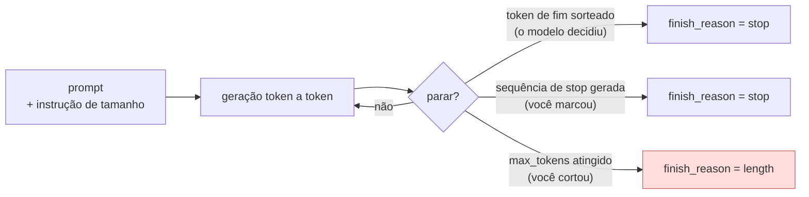

# IA Aplicada com LLMs — Aula 02: Escolha e configuração de modelos — Controle da saída

## Introdução

Um LLM não sabe quando parar.

Isso soa como provocação, mas é literal. Volte ao mecanismo da Aula 01: o modelo produz uma distribuição sobre o próximo token, sorteia um, e repete. Não existe, em nenhum lugar desse laço, um contador de palavras, um plano da resposta ou uma noção de "já falei o suficiente". O que existe é um token especial de fim de sequência que, **quando sorteado**, encerra a geração. Se ele não for sorteado, o modelo continua — e continua até alguém mandar parar.

Esse "alguém" é você. E daí vem uma distinção que organiza esta nota inteira:

| | Como se faz | Garantia | Efeito |
|---|---|---|---|
| **Instrução no prompt** | "responda em até 3 frases" | **nenhuma** — é sugestão | o modelo *tenta* obedecer; a forma da resposta melhora |
| **Parâmetro da API** | `max_tokens=150` | **absoluta** — é um corte | a geração para, obedecendo ou não |

Os dois são necessários, e por motivos diferentes. A instrução molda a resposta; o parâmetro impede o desastre. Quem usa só a instrução tem um sistema que quase sempre funciona. Quem usa só o parâmetro tem respostas cortadas no meio da frase. Quem usa os dois tem um sistema.

Esta nota trata dos quatro parâmetros que controlam **a saída** — quanto o modelo escreve, onde ele para, e o quanto ele se repete no caminho:

- **comprimento máximo** (`max_tokens`) — o orçamento de tokens;
- **sequências de parada** (`stop`) — a marca onde a geração termina;
- **penalidade de frequência** (`frequency_penalty`) — desestimula repetição proporcionalmente;
- **penalidade de presença** (`presence_penalty`) — desestimula reincidência, sem proporção.

> **Pré-requisitos:** a [nota 02](02-configuracoes-da-chamada.md) desta aula — a anatomia da requisição e a lição de que **parâmetro é contrato de API** (o nome, a faixa de valores e até a existência de cada um destes quatro variam por provedor). Esta nota aprofunda o que aquela apresentou; leia-a antes.

---

## Objetivos de aprendizagem

Ao final desta nota você deve ser capaz de:

- **Explicar** por que um LLM não controla o tamanho da própria resposta, e distinguir controle por **instrução** de controle por **parâmetro**.
- **Dimensionar** `max_tokens` para uma tarefa e **detectar** truncamento pelo `finish_reason`.
- **Projetar** sequências de parada para formatos estruturados — e-mail, lista, diálogo — e prever os efeitos colaterais delas.
- **Distinguir** penalidade de frequência de penalidade de presença pela fórmula, e prever o comportamento de cada uma.
- **Decidir** quando **não** usar penalidade — e reconhecer os casos em que ela quebra a saída.
- **Combinar** os quatro parâmetros para um caso de uso, justificando cada valor.

---

## Desenvolvimento teórico

### 1. Por que o modelo não controla o próprio tamanho

Peça a um LLM "escreva exatamente 50 palavras". Conte o resultado. Vai dar 43, ou 61, quase nunca 50.

A razão é a mesma pela qual ele erra ao contar letras (Aula 01, Parte 2): **o modelo não opera em palavras, opera em tokens**, e não tem um contador. Ele aprendeu, dos dados de treino, que um texto pedido "em 50 palavras" tem uma certa aparência — e produz um texto com essa aparência. É imitação de forma, não aritmética.

Consequência prática: **instrução de tamanho é estatística, não contrato.** Ela funciona bem para a *forma* ("seja breve", "um parágrafo", "em tópicos") e mal para o *número* ("exatamente 50 palavras", "no máximo 300 caracteres").



Repare que **duas** das três saídas são suas. O controle de tamanho é responsabilidade da sua aplicação — o modelo só oferece a primeira.

---

### 2. Comprimento máximo (`max_tokens`)

#### 2.1 O que é

`max_tokens` é o número máximo de tokens que o modelo pode **gerar** naquela chamada. Os tokens de entrada não contam para esse teto (mas contam para a janela de contexto — nota 01, §4.1).

Serve para três coisas, em ordem de importância prática:

1. **Teto de custo por chamada.** Token de saída é a tarifa cara (nota 04, §1). `max_tokens` é o único jeito de garantir que uma chamada não vai custar mais que X.
2. **Teto de latência.** Tempo de geração é proporcional ao número de tokens gerados. Resposta com teto tem tempo com teto.
3. **Proteção contra geração desgovernada.** Modelos entram em laços de repetição, especialmente com temperatura alta ou prompt confuso. Sem teto, isso vira uma chamada de milhares de tokens.

#### 2.2 O que **não** é

Este é o erro conceitual mais comum, e vale um aviso em destaque:

> **`max_tokens` não pede uma resposta mais curta. É uma guilhotina.**

O modelo **não sabe** qual é o seu `max_tokens`. Ele não planeja a resposta para caber no orçamento. Ele escreve como escreveria de qualquer jeito, e a geração é interrompida quando o contador estoura — no meio da frase, no meio da palavra, no meio do JSON.

Compare:

```python
# ERRADO — espera que o parâmetro encurte a resposta
client.chat.completions.create(
    model=MODELO,
    messages=[{"role": "user", "content": "Explique o que é RAG."}],
    max_tokens=50,          # resultado: metade de uma explicação longa
)

# CERTO — a instrução molda; o parâmetro protege
client.chat.completions.create(
    model=MODELO,
    messages=[{"role": "user", "content": "Explique o que é RAG em no máximo 2 frases."}],
    max_tokens=120,         # folga sobre o esperado, como rede de segurança
)
```

Na segunda versão, o teto **não deve ser atingido em operação normal**. Ele existe para o caso anormal. Se o seu `max_tokens` está sendo atingido com frequência, ele não está funcionando como proteção — está funcionando como censura.

#### 2.3 Como dimensionar

Um método que funciona:

1. **Meça o caso médio.** Rode a tarefa 10 vezes sem teto (ou com teto generoso) e olhe `usage.completion_tokens`.
2. **Estime o pior caso.** Para texto livre, ~2× a mediana. Para saída estruturada, calcule: o maior JSON que o seu schema permite, com todos os campos opcionais preenchidos e as strings no tamanho máximo.
3. **Some folga** e fixe. Para português, um detalhe da Aula 01 importa aqui: o mesmo conteúdo usa ~46% mais tokens que em inglês. Um teto dimensionado com exemplos em inglês trunca em produção.
4. **Monitore a taxa de `finish_reason="length"`.** Ela subindo é o aviso antecedente de que o seu dado cresceu.

#### 2.4 O `finish_reason` fecha o ciclo

Truncamento silencioso é o bug que o exercício desta aula explora, e a defesa é uma linha:

```python
escolha = resposta.choices[0]
if escolha.finish_reason == "length":
    raise ValueError("resposta truncada — max_tokens insuficiente")
```

Detalhe importante para saída estruturada: **um JSON truncado não é um JSON parcialmente útil, é um erro de sintaxe.** Se o corte veio no meio, o `json.loads` estoura e você não recupera nada — pagou os tokens todos e não levou nada. Por isso, com `response_format`, `max_tokens` apertado é ainda mais perigoso que em texto livre.

---

### 3. Sequências de parada (`stop`)

#### 3.1 O que são

`stop` recebe uma lista de textos. Quando o modelo gera qualquer um deles, a geração **para imediatamente**, e — detalhe que confunde muita gente — **a sequência não aparece na saída**. Você recebe o texto até o ponto anterior a ela.

```python
resposta = client.chat.completions.create(
    model=MODELO,
    messages=[{"role": "user", "content": prompt}],
    stop=["Atenciosamente", "Cordialmente"],
    max_tokens=400,
)
```

Enquanto `max_tokens` corta por **orçamento** (quantidade), `stop` corta por **conteúdo** (semântica). É a diferença entre "pare depois de 200 tokens" e "pare quando chegar na despedida".

#### 3.2 O caso do e-mail

O exemplo canônico. Você pede ao modelo que escreva um e-mail comercial e ele entrega o e-mail — mais a assinatura, mais um "espero que isso ajude!", mais uma oferta de ajuda adicional. Nada disso vai para o cliente.

Com `stop=["Atenciosamente", "Cordialmente", "Abraços"]`, a geração termina antes da despedida. Três ganhos de uma vez:

- **o texto sai no formato que você precisa** — você acrescenta a assinatura no código, com o nome certo do remetente, sem depender do modelo;
- **você não paga** pelos tokens do fechamento (nota 04: saída é a tarifa cara);
- **a resposta chega mais rápido**, porque tokens não gerados não custam tempo.

#### 3.3 Outros formatos estruturados

| Formato | `stop` típico | Por quê |
|---|---|---|
| **E-mail** | `["Atenciosamente", "Cordialmente"]` | corta a despedida; a assinatura é responsabilidade do código |
| **Lista numerada** de N itens | `["\n4."]` para 3 itens | evita o modelo continuar a lista além do pedido |
| **Diálogo** | `["Usuário:", "Cliente:"]` | impede o modelo de **inventar a fala do outro lado** — falha clássica |
| **Bloco de código** | ` ["```"] ` | corta o comentário explicativo que vem depois do código |
| **Um parágrafo** | `["\n\n"]` | a quebra dupla marca o fim do parágrafo |

O caso do **diálogo** merece destaque porque é um erro de aparência assustadora: sem `stop`, o modelo às vezes escreve a resposta do assistente **e** a próxima pergunta do usuário **e** a resposta seguinte, simulando uma conversa inteira sozinho. Não é bug do modelo: ele foi treinado para continuar texto, e o texto que ele viu tem os dois lados. `stop=["Usuário:"]` resolve.

#### 3.4 Os três cuidados

**Primeiro: a sequência pode aparecer legitimamente no meio do conteúdo.** Se você usa `stop=["3."]` para cortar uma lista no terceiro item, e o texto do item 1 menciona "R$ 3.500", a geração morre ali. Escolha sequências que **não podem** ocorrer no conteúdo — quanto mais específicas, melhor.

**Segundo: em muitos provedores, parar por `stop` devolve `finish_reason="stop"`** — indistinguível do término natural. Se a sua lógica precisa saber a diferença, teste o comportamento do seu provedor em vez de supor (nota 02, §2).

**Terceiro: `stop` não conserta um prompt ruim.** Se o modelo insiste em escrever a despedida, é sinal de que o prompt não deixou claro o formato. `stop` é a rede; o prompt é o combinado.

E há um limite prático: provedores aceitam um número pequeno de sequências (frequentemente 4). Não é um mecanismo para expressar regras complexas de formato — para isso existe `response_format` (nota 02, §7).

---

### 4. Penalidade de frequência

#### 4.1 O mecanismo

As duas penalidades agem no mesmo ponto do laço de geração: **depois** dos logits, **antes** do sorteio. Elas subtraem valor dos logits de tokens que já apareceram, tornando-os menos prováveis.

A **penalidade de frequência** desconta proporcionalmente à **contagem**:

$$z_i' = z_i - \alpha \cdot c_i$$

onde $z_i$ é o logit do token $i$, $c_i$ é quantas vezes ele já apareceu no texto gerado, e $\alpha$ é o valor de `frequency_penalty`.

A palavra importante é **proporcionalmente**: quanto mais o token se repete, mais forte fica o desconto. Um token usado 5 vezes leva um desconto 5× maior que um usado 1 vez. É um mecanismo com pressão crescente — ele combate especificamente a repetição **insistente**.

#### 4.2 O que ela resolve

O sintoma clássico: `"O produto é muito, muito, muito bom"`, ou um parágrafo que repete a mesma palavra-chave em toda frase. Isso acontece porque a repetição é **auto-reforçante**: um token que já apareceu no contexto ganha probabilidade de aparecer de novo (o modelo aprendeu que textos são coerentes e coesos), e sem contrapressão isso cria um laço.

A penalidade de frequência é a contrapressão.

#### 4.3 A faixa de valores

Tipicamente **−2 a 2**:

| Valor | Efeito |
|---|---|
| `0` | desligada (padrão) |
| `0,1 – 0,5` | correção suave; quase invisível na leitura |
| `0,5 – 1,0` | pressão perceptível: o vocabulário se abre |
| `> 1,0` | agressiva; começa a evitar palavras necessárias |
| **negativo** | **encoraja** repetição — o modelo trava em laço |

O valor negativo não serve para produção, mas é o melhor experimento didático da aula: coloque `frequency_penalty=-1.5` e veja o texto degringolar em repetição. É a demonstração de que o parâmetro realmente age sobre os logits.

---

### 5. Penalidade de presença

#### 5.1 O mecanismo

A **penalidade de presença** desconta um valor **fixo** assim que o token apareceu ao menos uma vez:

$$z_i' = z_i - \beta \cdot \mathbb{1}[c_i > 0]$$

onde $\mathbb{1}[c_i > 0]$ vale 1 se o token já apareceu e 0 se não. Não importa se apareceu uma vez ou vinte: o desconto é o mesmo.

#### 5.2 A diferença que importa

As duas parecem iguais na descrição e se comportam de forma bem diferente. Com $\alpha = \beta = 0{,}5$, acompanhe o desconto aplicado ao logit de um token conforme ele se repete:

| Vezes que o token já apareceu | Frequência ($-0{,}5 \cdot c$) | Presença ($-0{,}5$ se $c>0$) |
|---|---|---|
| 0 | 0 | 0 |
| 1 | −0,5 | **−0,5** |
| 2 | −1,0 | **−0,5** |
| 3 | −1,5 | **−0,5** |
| 5 | −2,5 | **−0,5** |

Lendo a tabela:

- a **presença** é um empurrão **único**, dado na primeira reincidência. Ela diz: *"você já falou disso; explore outra coisa."* Depois disso, ela não aumenta a pressão — o token repetido 5 vezes sofre o mesmo desconto do repetido 1 vez;
- a **frequência** é uma pressão **crescente**. Ela diz: *"cada vez que você repete, fica mais caro repetir de novo."*

Daí a divisão de trabalho:

| | Combate | Use quando |
|---|---|---|
| **`frequency_penalty`** | repetição **literal** e insistente da mesma palavra | o texto está repetitivo, martelando os mesmos termos |
| **`presence_penalty`** | permanecer no **mesmo assunto** / vocabulário | o texto é variado nas palavras mas gira em círculos nos temas — típico de brainstorm |

Uma forma de guardar: **frequência controla o texto; presença controla o assunto.** É por isso que, num brainstorm em que as ideias saem todas parecidas, `presence_penalty` é a tentativa mais razoável das duas.

---

### 6. Quando **não** usar penalidade

Esta seção é tão importante quanto as duas anteriores.

Penalidade é um instrumento **cego**: ela penaliza tokens, sem saber se aquele token era decorativo ou essencial. E existem tokens que a sua saída **precisa** repetir.

**Nunca use penalidade em:**

- **Saída estruturada (JSON, XML, código).** As chaves de um JSON repetem por construção; `{`, `"`, `:` e `,` aparecem dezenas de vezes. Penalizá-los é pedir para o modelo quebrar o formato. Com `response_format`, mantenha as duas penalidades em **0**.
- **Texto com terminologia técnica ou nomes próprios.** Um laudo sobre "hemoglobina glicada" precisa repetir "hemoglobina glicada". Com penalidade alta, o modelo começa a inventar sinônimos — e sinônimo inventado em texto técnico é erro factual.
- **Extração e classificação.** A saída é curta e determinada; não há repetição a combater, só risco de deformar o resultado.
- **Tabelas e listas com estrutura fixa.** Os rótulos repetem de propósito.

**E antes de usar em qualquer caso, considere a alternativa:** se o texto está repetitivo, o prompt provavelmente não disse o que você quer. Compare os dois caminhos:

```python
# Caminho 1 — girar o botão
resposta = gerar(prompt="Escreva sobre nossa cafeteria.", frequency_penalty=1.2)

# Caminho 2 — dizer o que você quer
resposta = gerar(prompt="""Escreva 3 parágrafos sobre nossa cafeteria.
Cada parágrafo trata de um aspecto diferente: o café, o ambiente, o atendimento.
Não repita a palavra "café" mais de uma vez por parágrafo.""")
```

O caminho 2 é mais confiável, mais legível, mais fácil de depurar e não tem efeito colateral. **A penalidade é o último recurso, não o primeiro.**

---

### 7. Os quatro juntos: receitas

| Caso de uso | `max_tokens` | `stop` | `frequency` | `presence` |
|---|---|---|---|---|
| **E-mail comercial** | 400 (folga) | `["Atenciosamente", "Cordialmente"]` | 0 | 0 |
| **Resposta de chat ao usuário** | 300 | — | 0 | 0 |
| **Extração / JSON** | pior caso do schema | — | **0** | **0** |
| **Lista de 3 itens** | 200 | `["\n4."]` | 0 | 0 – 0,3 |
| **Diálogo / roleplay** | 200 | `["Usuário:", "Cliente:"]` | 0 – 0,3 | 0 |
| **Brainstorm de ideias** | 500 | — | 0 – 0,3 | **0,3 – 0,6** |
| **Geração de código** | 800 | `["```"]` | **0** | **0** |
| **Resumo** | 2× a mediana medida | — | 0 | 0 |

Note que a coluna de penalidades é **quase toda zero**. Isso não é descuido: é o resumo honesto da seção 6.

---

## Exemplos

### Exemplo 1 — O e-mail que para na despedida

```python
import os
from dotenv import load_dotenv
from openai import OpenAI

load_dotenv()
client = OpenAI(base_url="https://api.mistral.ai/v1",
                api_key=os.environ.get("OPENAI_API_KEY"))

PEDIDO = """Escreva um e-mail curto avisando o cliente Ana que o pedido 48219
atrasou 3 dias e que o novo prazo é 25/08. Seja direto e peça desculpas uma vez."""

for rotulo, extras in [("sem stop", {}),
                       ("com stop", {"stop": ["Atenciosamente", "Cordialmente", "Abraços"]})]:
    resposta = client.chat.completions.create(
        model="mistral-small-latest",
        messages=[{"role": "user", "content": PEDIDO}],
        temperature=0.4,
        max_tokens=400,
        **extras,
    )
    escolha = resposta.choices[0]
    print(f"=== {rotulo} | finish_reason={escolha.finish_reason} "
          f"| tokens de saída={resposta.usage.completion_tokens}")
    print(escolha.message.content)
    print()

# A assinatura é responsabilidade do CÓDIGO, não do modelo:
ASSINATURA = "\n\nAtenciosamente,\nCentral de Atendimento — Transportadora XYZ\n(11) 4000-0000"
```

O que observar: a versão com `stop` gasta menos tokens de saída, e a despedida — que você controla no código, com o telefone certo e sem risco de o modelo inventar um cargo — é acrescentada depois. O e-mail fica mais curto e mais confiável ao mesmo tempo.

### Exemplo 2 — As duas penalidades lado a lado

```python
PROMPT = "Descreva as vantagens de comprar café em grão, em um parágrafo."

def repeticoes(texto, palavra):
    return texto.lower().count(palavra)

for rotulo, extras in [
    ("nenhuma          ", {}),
    ("frequency = 1.0  ", {"frequency_penalty": 1.0}),
    ("presence  = 1.0  ", {"presence_penalty": 1.0}),
    ("frequency = -1.5 ", {"frequency_penalty": -1.5}),   # veja degringolar
]:
    resposta = client.chat.completions.create(
        model="mistral-small-latest",
        messages=[{"role": "user", "content": PROMPT}],
        temperature=0.7, max_tokens=200, **extras,
    )
    texto = resposta.choices[0].message.content
    print(f"{rotulo} | 'café' aparece {repeticoes(texto, 'café')}x")
    print(f"  {texto}\n")
```

O que observar: com `frequency_penalty=1.0`, a contagem de "café" cai — e olhe **como** ela cai. O modelo passa a escrever "a bebida", "o produto", "ele". Em texto de marketing isso é bom. Num laudo técnico, seria substituir o termo correto por aproximações — o problema da seção 6.

O caso negativo é o mais instrutivo: com `-1.5` o texto costuma travar num laço de repetição. Prova, num comando, que o parâmetro age de verdade sobre os logits.

---

## Exercícios resolvidos

### 1. O resumo que chegava cortado

**Enunciado.** Um serviço resume avaliações de clientes com `max_tokens=100` e a instrução "resuma a avaliação". Reclamação recorrente: alguns resumos terminam no meio da frase. O time propôs subir `max_tokens` para 1000. Avalie a proposta e resolva.

**Resolução.**

**Diagnóstico.** Duas causas somadas. A **primeira** é que o prompt não pede resposta curta — "resuma a avaliação" não define tamanho, então o modelo produz o tamanho que a estatística dele sugere, que para avaliações longas passa de 100 tokens. A **segunda** é que `max_tokens=100` está sendo usado como se fosse um pedido de brevidade, quando é uma guilhotina (§2.2).

**Por que subir para 1000 é uma correção ruim** — e ela *funciona*, o que a torna pior:
- os resumos deixam de ser cortados, mas ficam **longos**, que não era o objetivo;
- o **custo de saída** pode multiplicar por até 10 (nota 04, §1: saída é a tarifa cara);
- a **latência** sobe junto;
- o problema real — o prompt não especifica tamanho — continua lá, agora escondido.

**Correção.** Atacar as duas causas na ordem certa:

```python
resposta = client.chat.completions.create(
    model=MODELO,
    messages=[{"role": "user", "content":
        f"Resuma esta avaliação em no máximo 2 frases:\n\n{avaliacao}"}],
    temperature=0.3,
    max_tokens=180,          # ~2 frases em português com folga de segurança
)
escolha = resposta.choices[0]

if escolha.finish_reason == "length":
    # não deveria acontecer em operação normal; se acontecer, tem que APARECER
    log.warning("resumo truncado — avaliação atípica: %s", id_avaliacao)
```

**Como escolher o 180.** Meça: rode 20 avaliações reais com teto generoso e olhe `usage.completion_tokens`. Se a mediana de "2 frases em português" ficar em ~90, o pior caso razoável é ~180. Não estime em inglês — português usa ~46% mais tokens para o mesmo conteúdo (Aula 01).

**A regra que fica:** *a instrução define o tamanho; o parâmetro impede o desastre.* Se o parâmetro está sendo atingido rotineiramente, os papéis estão trocados.

### 2. Escolhendo a penalidade certa (ou nenhuma)

**Enunciado.** Para cada situação, diga qual penalidade usar e com que valor — ou justifique não usar nenhuma:

**(a)** Descrições de produto que saem repetindo o nome do produto em toda frase.
**(b)** Um gerador de ideias de campanha cujas 10 sugestões giram todas em torno de "desconto".
**(c)** Um extrator que devolve JSON com 6 campos.
**(d)** Um assistente que escreve laudos médicos com termos técnicos.

**Resolução.**

**(a) `frequency_penalty` ≈ 0,4 — depois de tentar o prompt.** O sintoma é repetição **literal** do mesmo token, que é exatamente o alvo da penalidade proporcional. Mas tente primeiro: "não repita o nome do produto mais de uma vez; use 'ele' ou o tipo do produto nas outras menções". Se resolver, melhor — sem efeito colateral. Se não, 0,4 é um valor suave o suficiente para não deformar o texto. **Não** suba além de 1,0: o nome do produto é informação que o texto às vezes precisa repetir.

**(b) `presence_penalty` ≈ 0,5.** O problema aqui **não é a palavra**, é o **assunto** — as ideias podem estar usando vocabulário variado e ainda assim orbitarem "desconto". Presença é o instrumento certo, porque dá o empurrão único que tira o modelo do tema e não aumenta pressão sobre tokens que ele precise reusar. Combine com `temperature` ≈ 1,0 (é brainstorm) e, principalmente, com um prompt que peça diversidade explícita: "10 ideias, cada uma de uma categoria diferente: preço, experiência, comunidade, conveniência...". Note que a instrução provavelmente resolve mais que o parâmetro.

**(c) Nenhuma — as duas em 0, e isso não é preferência, é requisito.** As chaves do JSON repetem por construção, e os tokens estruturais (`{`, `"`, `:`, `,`) aparecem dezenas de vezes. Qualquer penalidade positiva empurra o modelo a **quebrar o formato** — trocar o nome de um campo, omitir uma chave, fechar mal. Use `response_format` com JSON Schema e penalidades zeradas (§6).

**(d) Nenhuma.** Terminologia técnica **tem** que repetir: "hemoglobina glicada" é "hemoglobina glicada" nas cinco vezes que aparecer. Com penalidade, o modelo busca sinônimos — e sinônimo inventado em laudo médico é erro factual com consequência clínica. Se o laudo estiver repetitivo de forma incômoda, o caminho é estrutura (seções, tópicos, template), não parâmetro de amostragem.

**O padrão nas quatro respostas:** em dois casos a resposta é "nenhuma", e nos outros dois a penalidade é a **segunda** tentativa, depois do prompt. Isso resume a seção 6 melhor que qualquer regra.

---

## Síntese

- **Um LLM não sabe quando parar.** Ele sorteia tokens até sortear o de fim de sequência. Duas das três formas de encerrar uma geração são **suas**: `max_tokens` e `stop`.
- **Instrução molda, parâmetro protege.** "Em 2 frases" melhora a forma sem garantia; `max_tokens` garante o corte sem melhorar a forma. Use os dois — a instrução para acertar o tamanho, o parâmetro como rede de segurança.
- O modelo **não conta palavras** (ele opera em tokens, sem contador): instrução de tamanho funciona para a *forma*, não para o *número exato*.
- **`max_tokens` é uma guilhotina, não um pedido de brevidade.** O modelo não sabe o valor do seu teto e não planeja para caber nele. Se o teto é atingido rotineiramente, ele está censurando, não protegendo.
- Dimensione `max_tokens` **medindo** (`usage.completion_tokens`), estime o pior caso do schema, e lembre que **português gasta ~46% mais tokens** que inglês.
- **Sempre checar `finish_reason="length"`.** Em saída estruturada, JSON truncado é perda total — você paga tudo e não leva nada.
- **`stop` corta por conteúdo**, `max_tokens` corta por orçamento. A sequência **não** aparece na saída; ela economiza tokens e latência, e devolve ao seu código o controle do que vem depois (a assinatura do e-mail, por exemplo).
- Formatos que pedem `stop`: e-mail (despedida), lista (item N+1), **diálogo** (`"Usuário:"`, impedindo o modelo de inventar a fala do outro lado), bloco de código.
- Cuidados com `stop`: a sequência pode ocorrer legitimamente no conteúdo; em muitos provedores é indistinguível do término natural no `finish_reason`; e ela não conserta prompt ruim.
- **`frequency_penalty`** desconta o logit **proporcionalmente à contagem** ($-\alpha c_i$): pressão crescente, combate repetição **literal**.
- **`presence_penalty`** desconta um valor **fixo** na primeira reincidência ($-\beta$ se $c_i>0$): empurrão único, combate permanência no **mesmo assunto**.
- Guarde a divisão: **frequência controla o texto; presença controla o assunto.** Faixa típica −2 a 2; negativo **encoraja** repetição (ótima demonstração, péssima produção).
- **Não use penalidade** em JSON/código (quebra o formato), terminologia técnica (vira sinônimo inventado), extração e listas com rótulos fixos.
- Na tabela de receitas, a coluna de penalidades é **quase toda zero**. Se o texto repete, o prompt quase sempre é a correção certa — **a penalidade é o último recurso, não o primeiro**.

---

## Fontes e leituras

**Papers**

- Holtzman, A. et al. — *The Curious Case of Neural Text Degeneration* (2019). [arxiv.org/abs/1904.09751](https://arxiv.org/abs/1904.09751) — por que a geração degenera em repetição, o fenômeno que as penalidades combatem.
- Keskar, N. S. et al. — *CTRL: A Conditional Transformer Language Model for Controllable Generation* (2019). [arxiv.org/abs/1909.05858](https://arxiv.org/abs/1909.05858) — a penalidade de repetição na formulação original.
- Welleck, S. et al. — *Neural Text Degeneration with Unlikelihood Training* (2019). [arxiv.org/abs/1908.04319](https://arxiv.org/abs/1908.04319) — atacar a repetição no treino, não na amostragem.

**Engenharia**

- Mistral — *Text generation*: [docs.mistral.ai](https://docs.mistral.ai) — quais destes quatro parâmetros a API aceita, com que nome e em que faixa.
- OpenAI — *Frequency and presence penalties*: [platform.openai.com/docs/advanced-usage](https://platform.openai.com/docs/advanced-usage) — as fórmulas exatas dos dois descontos.

**Nesta disciplina**

- [Aula 01 — Parte 2](../../aula-01-llms-e-agentes/notas-de-aula/02-llms-tokens-e-tokenizacao.md) — tokens, o token de fim de sequência e o custo em português.
- [Nota 02 desta aula](02-configuracoes-da-chamada.md) — a anatomia da requisição, "parâmetro é contrato de API" e a saída estruturada, que substitui `stop` quando o formato é complexo.
- [Nota 04 desta aula](04-custo-latencia-e-decisao.md) — por que token de saída é a tarifa cara, e como `max_tokens` e `stop` entram na conta.
- [`03-limites-e-parada.py`](https://github.com/celsocrivelaro/senac-llm-code/blob/main/aula02-modelos-e-parametros/03-limites-e-parada.py) e [`02-top-p-e-penalidades.py`](https://github.com/celsocrivelaro/senac-llm-code/blob/main/aula02-modelos-e-parametros/02-top-p-e-penalidades.py) — os experimentos desta nota.
- [Exercício da aula](../exercicios/exercicio_02.md) — o caso do extrator noturno, em que `max_tokens` e `frequency_penalty` mal configurados são dois dos cinco defeitos.
