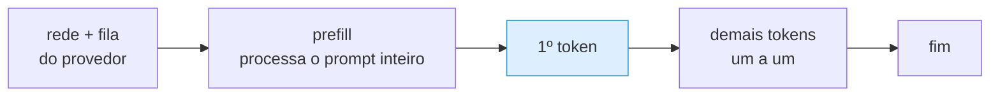
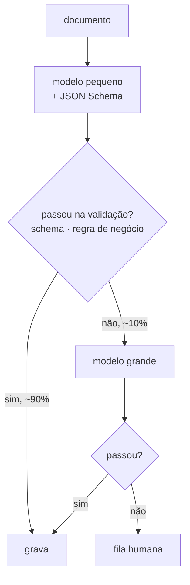

# IA Aplicada com LLMs — Aula 02: Escolha e configuração de modelos — Custo, latência e a decisão

## Introdução

As três notas anteriores deram os eixos qualitativos: o que diferencia um modelo, onde ele roda, o que cada parâmetro faz e como controlar a saída. Falta a parte que decide de verdade — e que quase nenhum curso ensina: **a conta**.

Um sistema de LLM tem uma característica incomum entre softwares: **o custo marginal por requisição não é desprezível**. Uma API REST comum custa frações de centavo por chamada, e ninguém pensa nisso. Uma chamada de LLM pode custar mil vezes mais — e um agente faz várias por tarefa. Isso muda o trabalho do engenheiro: custo deixa de ser assunto de infraestrutura e vira **requisito de projeto**, junto com latência e qualidade.

Esta nota ensina três coisas, nesta ordem:

1. **Fazer a conta** — do token ao custo mensal, sem chute.
2. **Medir latência** — TTFT e tokens por segundo, que são coisas diferentes e afetam produtos diferentes.
3. **Decidir com evidência** — por que leaderboard não decide nada e como montar o seu próprio benchmark.

No fim, a matriz de decisão que fecha a aula: um método reprodutível para responder "qual modelo eu uso aqui?" com números em vez de opinião.

> **Aviso sobre preços:** nenhum número de preço neste material é confiável — não porque esteja errado hoje, mas porque **preço de LLM muda**. Todos os valores usados nos exemplos são **ilustrativos** e servem só para você acompanhar a aritmética. Os preços reais estão em [mistral.ai/pricing](https://mistral.ai/pricing), e é de lá que você deve tirá-los, anotando a data.

---

## Objetivos de aprendizagem

Ao final desta nota você deve ser capaz de:

- **Calcular** o custo de uma requisição a partir dos tokens de entrada e saída, e projetar custo diário e mensal para um volume.
- **Explicar** por que entrada e saída têm preços diferentes e qual dos dois domina em RAG, em geração longa e em agentes.
- **Distinguir** TTFT, tokens/s e tempo total, e dizer qual importa em cada tipo de produto.
- **Medir** custo e latência de vários modelos com um script, e ler a tabela resultante levando o ruído em conta.
- **Argumentar** por que um leaderboard público não substitui um benchmark próprio.
- **Montar** um benchmark próprio de 5 tarefas e uma **matriz de decisão** de modelo.
- **Descrever** as alavancas de redução de custo, com o **roteamento de modelo** como a mais forte.

---

## Desenvolvimento teórico

### 1. A unidade de cobrança

Você paga por **token**, e paga **duas tarifas diferentes**:

| | O que é | Preço relativo | Por que |
|---|---|---|---|
| **Tokens de entrada** (*input*, *prompt*) | tudo que você manda: system prompt, histórico, documentos, schema | mais barato | processados **em paralelo**, numa passagem só (a fase de *prefill*) |
| **Tokens de saída** (*output*, *completion*) | tudo que o modelo gera | **mais caro**, tipicamente 3 a 5× | gerados **um de cada vez**, sequencialmente, cada um exigindo uma passagem pelo modelo |

A assimetria não é comercial, é física. O *prefill* processa mil tokens de prompt de uma vez, aproveitando o paralelismo da GPU. A geração é serial por natureza: para produzir o token 500, o modelo precisa ter produzido o 499.

Essa assimetria é a primeira coisa que orienta o projeto: **encher o prompt é relativamente barato; deixar o modelo escrever muito é caro**. Um resumo de 50 palavras a partir de um documento longo custa pouco. Uma redação de 2.000 palavras a partir de um prompt curto custa muito.

A fonte da verdade sobre quantos tokens você gastou vem na própria resposta:

```python
resposta = client.chat.completions.create(...)
uso = resposta.usage
print(uso.prompt_tokens, uso.completion_tokens, uso.total_tokens)
```

Estimativa com `tiktoken` serve para planejar; `usage` é o que foi **cobrado**. Não confunda os dois.

---

### 2. A conta, passo a passo

Preços são publicados por **1 milhão de tokens**. A fórmula:

$$\text{custo} = \frac{T_{\text{in}} \times P_{\text{in}} + T_{\text{out}} \times P_{\text{out}}}{1.000.000}$$

**Exemplo completo** (valores ilustrativos: $P_{\text{in}} = 0{,}20$ e $P_{\text{out}} = 0{,}60$ US$ por 1M tokens).

Um assistente de suporte com, por requisição:

- system prompt: 400 tokens
- histórico da conversa: 1.200 tokens
- pergunta do usuário: 100 tokens
- resposta: 300 tokens

**Passo 1 — somar por tarifa.** Entrada = 400 + 1.200 + 100 = **1.700 tokens**. Saída = **300 tokens**.

**Passo 2 — custo da requisição:**

$$\frac{1.700 \times 0{,}20}{10^6} + \frac{300 \times 0{,}60}{10^6} = 0{,}00034 + 0{,}00018 = \mathbf{0{,}00052}\ \text{US\$}$$

Meio milésimo de dólar. Parece nada — e é exatamente aí que mora o erro de julgamento.

**Passo 3 — multiplicar pelo volume.** Com 10.000 requisições por dia:

$$0{,}00052 \times 10.000 = 5{,}20\ \text{US\$/dia} \approx \mathbf{156}\ \text{US\$/mês}$$

**Passo 4 — projetar o crescimento.** Se o produto der certo e chegar a 500 mil requisições/dia: **~7.800 US$/mês**. E se, no caminho, alguém aumentar o system prompt de 400 para 2.000 tokens "para melhorar as respostas", a entrada quase dobra e a conta vai junto.

**A lição:** o custo unitário é irrelevante isoladamente. **Sempre multiplique pelo volume, e sempre projete o crescimento.** Um sistema barato no protótipo pode ser inviável em produção, e o momento de descobrir isso é agora, não depois do lançamento.

---

### 3. Onde o custo mora, por tipo de aplicação

O perfil de gasto muda completamente com a arquitetura:

| Aplicação | Perfil | O que domina | Onde economizar |
|---|---|---|---|
| **Classificação / extração** | entrada pequena, saída minúscula | nada domina; é barato | modelo menor (nota 01, §2.2) |
| **RAG** | entrada **enorme** (documentos recuperados), saída média | **entrada** | recuperar menos e melhor; *caching* do system prompt |
| **Geração longa** (relatório, redação) | entrada pequena, saída **enorme** | **saída** | pedir saída mais curta; modelo mais barato para rascunho |
| **Chat longo** | entrada cresce **a cada turno** | **entrada**, e cresce sozinha | resumir o histórico; janela deslizante |
| **Agente** | N chamadas por tarefa, cada uma carregando a trajetória | **tudo, multiplicado por N** | menos passos; modelo menor nos passos fáceis |

Dois casos merecem atenção especial.

**Chat longo cresce quadraticamente.** Já visto na Aula 01: o modelo não tem estado, então a cada turno você reenvia a conversa inteira. Turno 1 manda 1 mensagem; turno 10 manda 19. O custo total de uma conversa de $n$ turnos cresce com $n^2$, não com $n$. Uma conversa de 50 turnos custa **muito** mais que duas de 25.

**Agente multiplica tudo.** Uma tarefa que exige 8 passos são 8 chamadas, cada uma carregando o histórico da trajetória inteira até ali — ou seja, o mesmo crescimento quadrático, com prompts maiores. É por isso que a Aula 01, Parte 3, insiste em **teto de passos**: o teto é, antes de tudo, um controle de custo.

---

### 4. As alavancas de redução de custo

Em ordem aproximada de impacto:

1. **Trocar de modelo.** A alavanca mais forte, de longe. A diferença de preço entre um modelo pequeno e um de fronteira é de **uma a duas ordens de grandeza**. Se o modelo pequeno passa no seu teste, todas as outras otimizações são detalhe perto disso. É o que motiva o **roteamento** (§8).
2. **Encurtar o prompt.** System prompt enxuto, histórico resumido, menos documentos no RAG. Atenção: cada token cortado é cortado **em toda requisição, para sempre**.
3. **Limitar a saída.** `max_tokens` apertado e instrução explícita de tamanho ("responda em até 3 frases"). A saída é a tarifa cara.
4. **Prompt caching.** Quando o provedor oferece: a parte fixa do prompt (system prompt, instruções, exemplos) é armazenada e cobrada com desconto grande nas chamadas seguintes. Exige colocar o conteúdo **estável no início** e o variável no fim — decisão de arquitetura de prompt. Detalhado na aula de produção.
5. **Batch.** Vários provedores oferecem processamento assíncrono com desconto expressivo para trabalho que não é interativo (reprocessar histórico, classificar em massa). Se a resposta pode esperar horas, não pague preço de tempo real.
6. **Cache de resultado.** Perguntas repetidas não precisam de LLM nenhum: um dicionário resolve. Em atendimento, a cauda de perguntas idênticas costuma ser grande.

Note que 1, 2 e 3 estão inteiramente sob seu controle e não dependem de nenhuma tecnologia especial. A maior parte do desperdício em sistemas de LLM é desperdício **simples**.

---

### 5. Latência: três números diferentes

Latência não é um número, são três — e confundi-los leva a otimizar a coisa errada.



```text
  |<---------- TTFT ---------->|<------- geração (tokens/s) ------->|
  |  rede+fila  |   prefill    | t1 t2 t3 t4 t5 t6 t7 t8 t9 ... tN  |
  |<--------------------- tempo total ------------------------------>|
```

| Métrica | O que mede | Afetada por | Importa quando |
|---|---|---|---|
| **TTFT** (*time to first token*) | tempo até a primeira palavra aparecer | tamanho do **prompt**, fila do provedor, tamanho do modelo | interface com usuário; é o que ele sente como "travou" |
| **Tokens/s** | velocidade de geração depois que começou | tamanho do modelo, hardware, concorrência | respostas longas |
| **Tempo total** | ponta a ponta | os dois acima + tamanho da resposta | processamento em lote, pipelines, agentes |

Consequências práticas:

- **Produto interativo**: otimize **TTFT** e use streaming. O tempo total pode até piorar um pouco; a experiência melhora muito.
- **Processamento em lote**: TTFT é irrelevante. O que importa é **throughput** — quantas tarefas por minuto —, e aí paralelismo (várias requisições simultâneas) vale mais que velocidade individual.
- **Agente**: o tempo total é a **soma da trajetória**. Oito chamadas de 3 segundos são 24 segundos de espera. É por isso que agentes precisam mostrar progresso ao usuário — e por que trocar o modelo dos passos simples por um menor melhora a experiência tanto quanto o custo.
- **Prompt grande piora o TTFT**: o *prefill* precisa processar tudo antes do primeiro token. RAG com 20 documentos é lento por construção, não por acaso.

---

### 6. Medindo: o benchmark próprio

Chega de teoria. O script [`06-benchmark-modelos.py`](https://github.com/celsocrivelaro/senac-llm-code/blob/main/aula02-modelos-e-parametros/06-benchmark-modelos.py) roda a mesma bateria de tarefas em vários modelos e mede tudo. O núcleo:

```python
def medir(modelo, prompt):
    inicio = time.perf_counter()
    ttft, pedacos, uso = None, [], None

    fluxo = client.chat.completions.create(
        model=modelo, messages=[{"role": "user", "content": prompt}],
        temperature=0, max_tokens=MAX_TOKENS,
        stream=True, stream_options={"include_usage": True},
    )
    for evento in fluxo:
        if getattr(evento, "usage", None):
            uso = evento.usage                       # vem no último evento
        if evento.choices and evento.choices[0].delta.content:
            if ttft is None:
                ttft = time.perf_counter() - inicio  # <- o primeiro token
            pedacos.append(evento.choices[0].delta.content)

    return {"ttft": ttft, "total": time.perf_counter() - inicio,
            "entrada": uso.prompt_tokens, "saida": uso.completion_tokens,
            "texto": "".join(pedacos)}
```

Três cuidados na hora de ler o resultado:

**Uma medição não é uma medição.** Latência de API varia com a fila do provedor, a rede e a hora do dia. Uma execução tem ruído fácil de 2×. Para decidir, repita cada par (modelo, tarefa) pelo menos 5 vezes e use a **mediana** — não a média, que uma única execução lenta distorce.

**Velocidade e custo estão medidos; qualidade não.** O script não sabe se a resposta está certa. Ele salva o texto no CSV **para você julgar** — e é esse julgamento que dá valor ao resto. Uma tabela de latência sem avaliação de qualidade é uma tabela sobre quem erra mais rápido.

**O custo depende de você ter preenchido os preços.** O dicionário `PRECOS` no topo do script vem em branco de propósito; o script mostra `-` até você preenchê-lo com os valores da página oficial.

Para visualizar o resultado, um gráfico de dispersão custo × latência — cada ponto é um modelo, e o tamanho ou a cor podem marcar a sua nota de qualidade:

```python
# gera imagens/custo-x-latencia.png a partir do benchmark.csv do laboratório
import csv, collections
import matplotlib.pyplot as plt

pontos = collections.defaultdict(lambda: {"lat": [], "custo": []})
with open("benchmark.csv", encoding="utf-8") as f:
    for linha in csv.DictReader(f):
        if linha["custo_usd"]:
            pontos[linha["modelo"]]["lat"].append(float(linha["total_s"]))
            pontos[linha["modelo"]]["custo"].append(float(linha["custo_usd"]))

fig, ax = plt.subplots(figsize=(7, 5))
for modelo, d in pontos.items():
    x = sum(d["lat"]) / len(d["lat"])
    y = sum(d["custo"]) / len(d["custo"]) * 1000      # custo por 1.000 chamadas
    ax.scatter(x, y, s=120)
    ax.annotate(modelo, (x, y), textcoords="offset points", xytext=(6, 6))

ax.set_xlabel("latência média (s)")
ax.set_ylabel("custo por 1.000 requisições (US$)")
ax.set_title("Custo × latência — benchmark próprio")
ax.grid(alpha=0.3)
fig.tight_layout()
fig.savefig("custo-x-latencia.png", dpi=150)
```

O canto inferior esquerdo é o melhor lugar do gráfico: barato e rápido. Se um modelo estiver lá **e** for bom o suficiente na sua tarefa, a decisão está tomada.

---

### 7. Leaderboard não decide nada

Existe uma tentação óbvia: procurar o ranking, pegar o primeiro colocado, pronto. Quatro razões para não fazer isso.

**A tarefa não é a sua.** Benchmarks medem tarefas gerais — perguntas de múltipla escolha, problemas de matemática de competição, desafios de programação. O seu problema é "extrair o número da nota fiscal deste PDF meia-boca" ou "classificar reclamação de cliente em português com gíria regional". A correlação entre esses dois mundos é fraca.

**Contaminação.** Benchmarks públicos vazam para os dados de treino. Um modelo pode ir bem em um teste porque **viu o teste**, e isso não se transfere para o seu caso.

**A média esconde a variância.** Um modelo com 80% de acerto pode ser péssimo justamente na fatia que você precisa. Pior, para agentes: *acertar uma vez* (`pass@1`) é muito diferente de *acertar todas as vezes* (`pass^k`). Um agente que resolve a tarefa em 6 de 10 tentativas é inútil para automação — e brilha no leaderboard. Isso volta com nome e método na aula de evals.

**Nada disso mede custo e latência no seu contexto.** O primeiro colocado costuma ser o mais caro e o mais lento.

**O que substitui:** um benchmark próprio de **5 a 20 tarefas reais** do seu domínio, com o resultado esperado anotado. Leva algumas horas para montar e é o ativo mais valioso do projeto — ele responde a pergunta que interessa, e continua respondendo quando um modelo novo sair. Você acabou de montar a primeira versão dele no laboratório desta aula.

---

### 8. A matriz de decisão

Reunindo tudo. Para cada caso de uso, preencha:

| Eixo | Pergunta | Como obter |
|---|---|---|
| **Qualidade** | passa nas minhas N tarefas? | benchmark próprio + julgamento humano |
| **Custo** | US$ por requisição e por mês no meu volume | §2, com os preços de hoje |
| **Latência** | TTFT e tempo total aceitáveis? | `06-benchmark-modelos.py`, mediana de 5 |
| **Contexto** | cabe meu maior prompt + resposta? | `00-catalogo-modelos.py` |
| **Formato** | suporta JSON Schema / tools? | `00-catalogo-modelos.py` + teste real |
| **Dados** | posso mandar esse conteúdo para lá? | política do provedor, jurídico |
| **Estabilidade** | versão fixável? plano de deprecação? | documentação do provedor |

**Exemplo preenchido** — extração de dados de nota fiscal, 50 mil documentos/dia:

| Eixo | Modelo pequeno | Modelo grande | Decisão |
|---|---|---|---|
| Qualidade (20 notas reais) | 18/20 | 20/20 | grande ganha |
| Custo/mês (estimado) | ~US$ 90 | ~US$ 1.800 | **pequeno ganha por 20×** |
| Latência (mediana) | 0,8 s | 2,4 s | pequeno ganha |
| Contexto | suficiente | suficiente | empate |
| JSON Schema | sim | sim | empate |
| Dados | mesmo provedor | mesmo provedor | empate |

**Decisão: modelo pequeno, com escalonamento.** Ele resolve 90% dos casos por 5% do preço. Os 2 casos que ele erra não somem — são tratados: quando a extração falhar na validação (schema, regra de negócio, confiança baixa), **refaça no modelo grande**. Isso é **roteamento**, e a conta fica em torno de US$ 90 + 10% do custo do grande ≈ **US$ 270/mês** em vez de US$ 1.800, com a qualidade do grande onde ela é necessária.



Guarde esse desenho: **modelo pequeno + validação + escalonamento** é o padrão de arquitetura mais rentável de todo o curso. Ele reaparece em agentes (passos simples no modelo barato), em RAG (rerank barato antes do caro) e em produção (roteamento como política).

E note a terceira saída do fluxo: **fila humana**. Todo sistema de LLM sério tem uma. A pergunta não é "o modelo erra?" — ele erra —, é "o que acontece quando erra?".

---

## Exemplos

### Exemplo 1 — Três arquiteturas, o mesmo produto, contas muito diferentes

Um assistente que responde perguntas sobre a documentação interna da empresa. Preços ilustrativos: entrada 0,20 e saída 0,60 US$/1M tokens; 5.000 perguntas por dia.

**Arquitetura A — despejar tudo no prompt.** Manual inteiro (80.000 tokens) + pergunta (50) + resposta (400):

$$\frac{80.050 \times 0{,}20 + 400 \times 0{,}60}{10^6} = 0{,}01601 + 0{,}00024 \approx 0{,}0163\ \text{US\$}$$

$$0{,}0163 \times 5.000 \times 30 \approx \mathbf{2.445}\ \text{US\$/mês}$$

**Arquitetura B — RAG: recuperar 5 trechos relevantes.** Entrada de 3.000 tokens + 50 + resposta de 400:

$$\frac{3.050 \times 0{,}20 + 400 \times 0{,}60}{10^6} \approx 0{,}00085\ \text{US\$} \Rightarrow \approx \mathbf{128}\ \text{US\$/mês}$$

**Arquitetura C — RAG + cache de perguntas repetidas** (suponha 30% de repetição, medido no log):

$$128 \times 0{,}7 \approx \mathbf{90}\ \text{US\$/mês}$$

**A leitura correta:** de A para B é uma redução de **19×**, e não veio de escolher outro modelo nem de mexer em parâmetro — veio de **arquitetura**. E o RAG provavelmente responde *melhor*, porque 80 mil tokens de contexto sofrem de *lost in the middle* (nota 01, §4.3). A alavanca mais forte de custo costuma ser também a mais forte de qualidade.

### Exemplo 2 — Lendo uma tabela de benchmark

Suponha esta saída do `06-benchmark-modelos.py` (mediana de 5 execuções, valores ilustrativos):

| modelo | tarefa | TTFT | total | tok/s | in | out | US$ |
|---|---|---|---|---|---|---|---|
| pequeno | resumo | 0,31s | 1,9s | 95 | 82 | 180 | 0,000038 |
| pequeno | código | 0,29s | 3,1s | 92 | 25 | 285 | 0,000058 |
| pequeno | raciocínio | 0,33s | 2,8s | 90 | 48 | 252 | 0,000053 |
| médio | resumo | 0,58s | 3,6s | 52 | 82 | 187 | 0,000131 |
| médio | código | 0,61s | 6,2s | 48 | 25 | 298 | 0,000199 |
| médio | raciocínio | 0,55s | 5,4s | 50 | 48 | 270 | 0,000181 |

**O que a tabela diz:** o pequeno é ~2× mais rápido no TTFT, ~1,9× mais rápido em tokens/s e ~3,5× mais barato. Os tokens de saída são parecidos — os dois foram igualmente prolixos.

**O que a tabela NÃO diz:** qual acertou. Você precisa abrir o CSV e ler as respostas. Cenário típico: os dois empatam no resumo, o médio ganha claramente no código e no raciocínio.

**A decisão que sai daí não é "um modelo":** é **resumo no pequeno, código e raciocínio no médio**. Você acabou de projetar um roteador por tipo de tarefa, com evidência.

---

## Exercícios resolvidos

### 1. A conta do chatbot que cresce sozinha

**Enunciado.** Um chatbot de atendimento tem system prompt de 500 tokens e conversas de 20 turnos. Cada mensagem do usuário tem ~60 tokens e cada resposta ~200. Com preços de 0,20 (entrada) e 0,60 (saída) US$/1M e 2.000 conversas/dia, qual o custo mensal? E se você resumir o histórico a cada 10 turnos, mantendo-o em no máximo 800 tokens?

**Resolução.**

**Cenário 1 — histórico completo.**

No turno $k$, a entrada é: system (500) + todos os turnos anteriores + a mensagem atual. Cada turno anterior soma 60 + 200 = 260 tokens.

$$T_{\text{in}}(k) = 500 + 260(k-1) + 60$$

Somando de $k=1$ a 20:

$$\sum_{k=1}^{20} T_{\text{in}}(k) = 20 \times 560 + 260 \times \frac{19 \times 20}{2} = 11.200 + 49.400 = 60.600\ \text{tokens}$$

Saída: $20 \times 200 = 4.000$ tokens.

$$\text{custo/conversa} = \frac{60.600 \times 0{,}20 + 4.000 \times 0{,}60}{10^6} = 0{,}01212 + 0{,}00240 = 0{,}01452\ \text{US\$}$$

$$0{,}01452 \times 2.000 \times 30 \approx \mathbf{871}\ \text{US\$/mês}$$

Repare no termo $\frac{19 \times 20}{2}$: é a **soma quadrática** da Aula 01 aparecendo na fatura. O histórico responde por 49.400 dos 60.600 tokens de entrada — **81% do custo de entrada é conversa reenviada**.

**Cenário 2 — histórico resumido, teto de 800 tokens.**

A entrada por turno estabiliza em 500 + 800 + 60 = 1.360 tokens (após os primeiros turnos; usamos o teto para simplificar, o que é uma estimativa conservadora — para cima).

$$T_{\text{in}} \approx 20 \times 1.360 = 27.200\ \text{tokens}$$

$$\text{custo/conversa} = \frac{27.200 \times 0{,}20 + 4.000 \times 0{,}60}{10^6} = 0{,}00544 + 0{,}00240 = 0{,}00784\ \text{US\$}$$

$$\approx \mathbf{470}\ \text{US\$/mês}$$

Comparando só as chamadas de conversa, a economia parece ser de **46%** (871 → 470). Mas essa conta está incompleta, e é justamente aqui que a maioria das apresentações de "otimização de custo" mente por omissão: **os resumos são chamadas extras de LLM.**

**Cenário 2, com o custo escondido.** Resumindo a cada 10 turnos, são 2 resumos por conversa. Cada resumo lê ~10 turnos (2.600 tokens) e escreve até 800:

$$\frac{2.600 \times 0{,}20 + 800 \times 0{,}60}{10^6} = 0{,}00052 + 0{,}00048 = 0{,}00100\ \text{US\$ por resumo}$$

$$0{,}00100 \times 2 \times 2.000 \times 30 = \mathbf{120}\ \text{US\$/mês}\ \text{só de resumo}$$

Total real do cenário 2: $470 + 120 = \mathbf{590}$ US$/mês. **Economia verdadeira: ~32%**, não 46%.

Ainda vale a pena — mas o número honesto é um terço, não metade. Duas alavancas óbvias para melhorar: resumir com um **modelo menor** (resumir é tarefa fácil, exatamente o caso da nota 01, §2.2) e resumir com **menos frequência**, já que o custo do resumo é fixo e o do histórico é quadrático.

**Observação de projeto:** o ganho **cresce** com o número de turnos, porque ele ataca o termo quadrático. Em conversas de 5 turnos, não vale a complexidade; em conversas de 50, é obrigatório. Meça a distribuição real de turnos antes de implementar.

### 2. Montando um benchmark próprio

**Enunciado.** Você vai escolher o modelo de um sistema que classifica e-mails de clientes em 6 categorias e extrai o número do pedido quando houver. Descreva o benchmark que você montaria e como decidiria.

**Resolução.**

**Passo 1 — o conjunto (o trabalho de verdade).** 30 e-mails **reais**, anonimizados, escolhidos para cobrir: as 6 categorias (5 cada), casos fáceis e ambíguos, e-mails com e sem número de pedido, um com **dois** números (qual é o certo?), um em português mal escrito, um muito curto ("e aí?") e um muito longo. Para cada um, anote à mão a categoria correta e o pedido correto. **Este conjunto é o ativo** — sem ele não há decisão, só opinião.

**Passo 2 — a métrica.** Duas, porque são duas tarefas:
- **acurácia de categoria** (acertou o rótulo?);
- **exatidão do pedido** (extraiu o número certo, ou corretamente devolveu nulo quando não havia?).

E, como esta é uma tarefa fechada, uma métrica de confiabilidade: rode **3 vezes** cada e-mail e conte em quantos o modelo acertou **as 3** (o espírito do `pass^k`). Um classificador que oscila entre duas categorias é inútil, mesmo com acurácia média boa.

**Passo 3 — os candidatos.** 3 modelos: um pequeno, um médio, um grande — todos com `temperature=0` e o **mesmo** JSON Schema com `enum` para a categoria (nota 02, §7). Configuração idêntica para todos: se você mudar o prompt entre modelos, não está mais comparando modelos.

**Passo 4 — medir.** Adaptar o `06-benchmark-modelos.py`: as tarefas viram os 30 e-mails, e o script já dá latência, tokens e custo. Acrescentar a comparação automática com o gabarito — o que é fácil, porque a saída é estruturada.

**Passo 5 — decidir.** Uma linha por modelo:

| Modelo | Acurácia | Acertou 3/3 | Pedido | US$/mês (volume real) | Latência |
|---|---|---|---|---|---|

E aplicar a regra: **o menor modelo que atinge o limiar de qualidade acordado com a área de negócio**. Note que o limiar tem que ser definido *antes* de ver os resultados — senão a decisão vira racionalização.

**Passo 6 — o que fazer com os erros.** Se o pequeno erra 3 dos 30 em uma categoria específica, isso não é necessariamente motivo para descartá-lo: pode ser roteamento (categoria ambígua → modelo grande), pode ser prompt (a definição da categoria está vaga) ou pode ser fila humana. Erro conhecido e tratado é melhor que erro desconhecido.

**Passo 7 — versionar.** Guarde o conjunto e o resultado no repositório. Quando sair um modelo novo, rodar de novo é meia hora — e você terá uma resposta em vez de um palpite. Esse conjunto é a primeira suíte de *evals* do curso.

---

## Síntese

- Você paga **duas tarifas**: entrada (barata, processada em paralelo no *prefill*) e saída (3–5× mais cara, gerada serialmente). Encher o prompt é relativamente barato; deixar o modelo escrever muito é caro.
- Custo por requisição $= (T_{in} \times P_{in} + T_{out} \times P_{out}) / 10^6$. **O número unitário é enganoso — sempre multiplique pelo volume e projete o crescimento.**
- `usage.prompt_tokens` / `completion_tokens` é a verdade cobrada; `tiktoken` é estimativa de planejamento.
- O perfil de custo muda com a arquitetura: **RAG** gasta na entrada, **geração longa** na saída, **chat** cresce quadraticamente com os turnos, **agente** multiplica tudo pelo número de passos.
- Alavancas, em ordem de impacto: **trocar de modelo** (1–2 ordens de grandeza) > encurtar prompt > limitar saída > *prompt caching* > batch > cache de resultado.
- Latência são **três números**: TTFT (o que o usuário sente), tokens/s (respostas longas) e total (lote e agentes). Streaming melhora o TTFT percebido sem mudar o total.
- Prompt grande piora o TTFT — o *prefill* processa tudo antes do primeiro token.
- **Meça com repetição**: latência de API varia com fila e horário; use a **mediana de 5**, não uma execução.
- O script mede custo e velocidade; **qualidade quem julga é você**, lendo as respostas. Tabela sem julgamento é ranking de quem erra mais rápido.
- **Leaderboard não decide**: tarefa diferente da sua, contaminação de treino, média que esconde variância (`pass@1` ≠ `pass^k`), e nenhuma menção a custo e latência no seu contexto.
- **Benchmark próprio de 5–20 tarefas reais com gabarito** é o ativo mais valioso do projeto — e é a primeira suíte de evals do curso.
- A **matriz de decisão** tem sete eixos: qualidade, custo, latência, contexto, formato, política de dados e estabilidade. Preencha antes de escolher, e defina o limiar de qualidade **antes** de ver os números.
- **Modelo pequeno + validação + escalonamento** é o padrão mais rentável do curso: qualidade do grande onde precisa, preço do pequeno no resto — e uma fila humana como última saída.

---

## Fontes e leituras

**Engenharia**

- Preços da Mistral: [mistral.ai/pricing](https://mistral.ai/pricing) — **a fonte**; anote a data da consulta no seu material.
- Documentação da Mistral: [docs.mistral.ai](https://docs.mistral.ai) — limites de requisição, streaming e o campo `usage`.
- Artificial Analysis: [artificialanalysis.ai](https://artificialanalysis.ai) — comparação independente de preço, TTFT e tokens/s entre provedores. Use como ponto de partida, **nunca** como decisão.
- LMArena: [lmarena.ai](https://lmarena.ai) — ranking por preferência humana. Bom para saber o que existe; ruim para escolher para a sua tarefa (§7).
- LiteLLM: [docs.litellm.ai](https://docs.litellm.ai) — gateway com controle de orçamento e roteamento entre modelos.

**Conceitos que voltam no curso**

- τ-bench / τ²-bench — benchmarks de agente em atendimento, e a distinção `pass@1` × `pass^k` (confiabilidade × capacidade). Aula de evals.
- *Prompt caching* — desconto na parte fixa do prompt; exige ordenar o prompt com o estável no início. Aula de produção.
- OpenTelemetry GenAI semantic conventions — como instrumentar custo e latência de forma neutra de fornecedor. Aula de observabilidade.

**Nesta disciplina**

- [Aula 01 — Parte 2](../../aula-01-llms-e-agentes/notas-de-aula/02-llms-tokens-e-tokenizacao.md) — tokens como unidade de cobrança e o crescimento quadrático do chat.
- [Aula 01 — Parte 3](../../aula-01-llms-e-agentes/notas-de-aula/03-agentes-de-ia.md) — o custo da trajetória de um agente e o teto de passos.
- [Nota 01 desta aula](01-escolha-de-modelos.md) — os eixos qualitativos e onde o modelo roda.
- [Nota 02 desta aula](02-configuracoes-da-chamada.md) — os parâmetros e a saída estruturada que tornam o roteamento viável.
- [Nota 03 desta aula](03-controle-da-saida.md) — `max_tokens` e `stop` como alavancas diretas do custo de saída.
- [`codigo/aula02-modelos-e-parametros/06-benchmark-modelos.py`](https://github.com/celsocrivelaro/senac-llm-code/blob/main/aula02-modelos-e-parametros/06-benchmark-modelos.py) — o laboratório desta nota.
